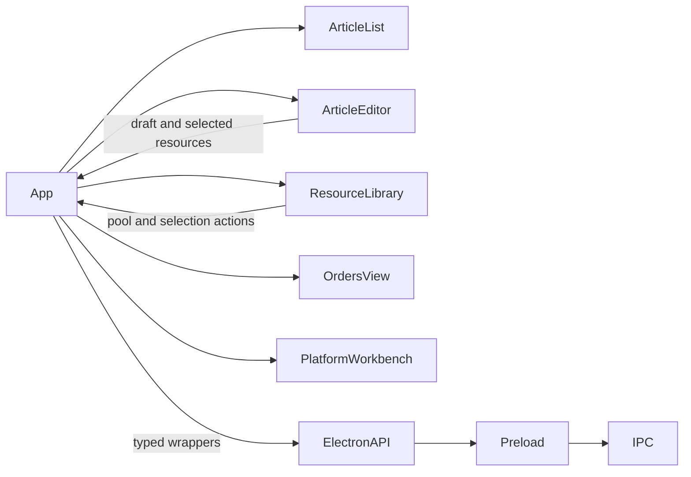

# Media Workbench UI

媒体工作台的生产入口是 `media-workbench/dist`，源码位于 `media-workbench/src`。

## React 组件

- `src/App.tsx` 负责加载媒体文章、资源池、余额、订单和平台工作台，并切换主视图。
- `src/components/ArticleList.tsx` 展示待处理稿件并触发预览。
- `src/components/ArticleEditor.tsx` 负责文章预览、草稿编辑和已选媒体移除。
- `src/components/ResourceLibrary.tsx` 负责资源搜索、分页、资源池管理和文章媒体选择。
- `src/components/OrdersView.tsx` 展示订单 DTO，并提供订单同步入口。
- `src/components/PlatformWorkbench.tsx` 负责其他平台的文章/平台选择和提交确认。

## 数据流



渲染器只通过 `media-workbench/src/electron-api.ts` 调用 preload API。分页、资源归一化、订单 DTO 和投稿任务由主进程 service 负责；组件不读取文件系统，也不直接调用外部媒体接口。

## 相关验证

```powershell
npm --prefix media-workbench run lint
npm run build:renderer
node --test tests/media-workbench-flow.test.js tests/media-article-drawer-boundary.test.js tests/media-resource-ux.test.js tests/media-order-service.test.js tests/renderer-resource-library-api.test.js
```
