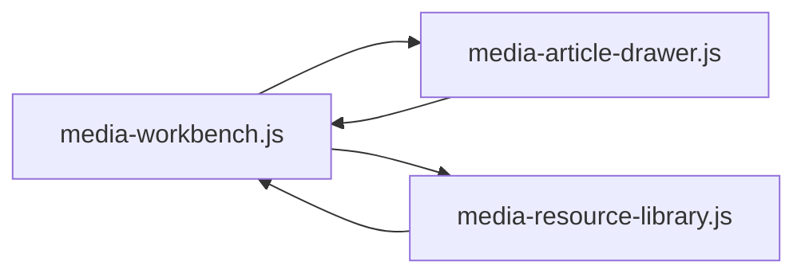

# Media Workbench UI

这份文档说明媒体投稿界面里最相关的 3 个脚本，以及你改 UI 时应该优先碰哪里。

## 三个脚本

### `desktop/renderer/media-workbench.js`

这是整个“媒体投稿”页面的总装配器。

它负责：
- 渲染页面骨架
- 放置文章列表、文章详情区、右侧媒体池
- 打开文章详情
- 维护当前文章的选择状态
- 把选择状态同步给文章详情和媒体池

你想改这些内容时，优先改这里：
- 页面布局怎么排
- 哪一块在左、哪一块在右
- 文章打开后详情显示在哪
- 右侧媒体池是否一直可见
- 文章列表上显示多少个媒体

### `desktop/renderer/media-article-drawer.js`

这是“文章详情”面板。

它负责：
- 文章预览
- 草稿标题和备注编辑
- 已选媒体摘要展示
- 保存草稿
- 从摘要里取消已选媒体

你想改这些内容时，优先改这里：
- 文章详情里的文案
- 摘要区长什么样
- 每个已选媒体怎么显示
- 取消按钮的位置和样式
- 草稿表单的排列

### `desktop/renderer/media-resource-library.js`

这是右侧媒体池和资源库。

它负责：
- 显示媒体池
- 显示资源库分页和搜索
- 在管理模式下维护媒体池
- 在选择模式下给当前文章选媒体

你想改这些内容时，优先改这里：
- 媒体池列表样式
- 资源库搜索和分页
- “选择/取消选择”按钮
- 右侧提示文案
- 媒体是否已在池中

## 数据流

简单理解就是：
- `media-workbench.js` 是总控
- `media-article-drawer.js` 负责文章详情内部
- `media-resource-library.js` 负责右侧媒体池
- 文章里选中/取消媒体后，状态会回写到 workbench，再同步给另外两个脚本

## 改 UI 时的建议

- 只改视觉样式，优先动 `desktop/renderer/styles.css`
- 改页面结构，优先动 `media-workbench.js`
- 改文章详情内部，优先动 `media-article-drawer.js`
- 改右侧媒体池交互，优先动 `media-resource-library.js`

## 当前交互约定

- 先把媒体加入媒体池
- 再打开文章
- 文章详情里的“已选媒体摘要”只展示当前选择
- 摘要里的媒体可以直接取消
- 选择和取消都会同步到右侧媒体池

## 相关文件

- [media-workbench.js](../desktop/renderer/media-workbench.js)
- [media-article-drawer.js](../desktop/renderer/media-article-drawer.js)
- [media-resource-library.js](../desktop/renderer/media-resource-library.js)
- [styles.css](../desktop/renderer/styles.css)
