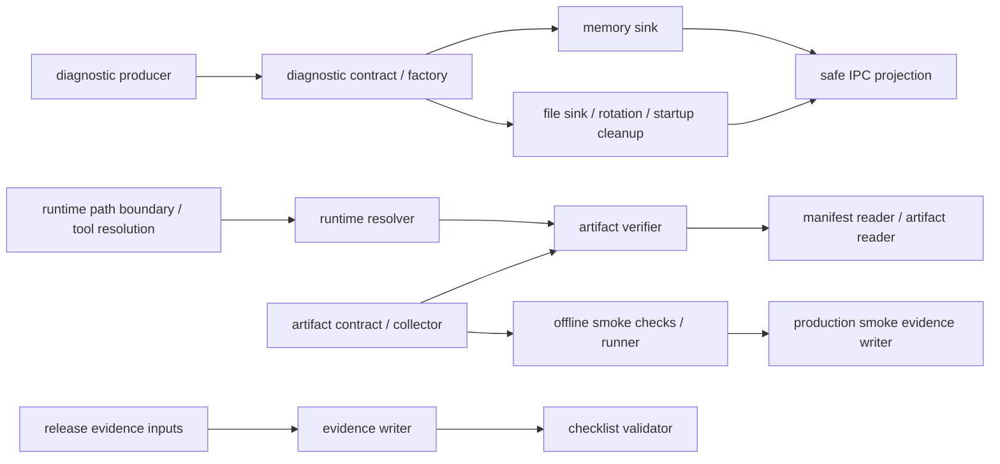

# Phase 8 handoff

Phase 7 leaves the repository with automated local evidence and explicit
release blockers. Start the next phase by reading:

- `docs/release-checklist.md` for stable required checks and manual gates;
- `build/release-evidence-manifest.json` for the latest safe evidence summary;
- `.scratch/phase-07-auth-build-observability/issues/06-production-packaging-smoke.md`;
- `.scratch/phase-07-auth-build-observability/issues/07-ci-release-checklist-handoff.md`.

The next phase must not infer platform TLS, proxy source headers, code signing,
installer ACL, SmartScreen, upgrade/rollback, or external E2E acceptance from
local fixtures. Those remain owner-controlled `PENDING_HUMAN` release gates.

Operational facts carried forward:

- Auth schema is version 2; readiness is a light probe and full integrity is a
  controlled operation.
- Content workspace schema is version 1; future or older markers fail closed
  until an explicit upgrade path exists.
- Installation, roaming configuration, local state, and content library roots
  must remain distinct.
- Diagnostic records use the structured schema and safe DTO projection; raw
  `publish-log` data is not a supported evidence source.
- The production directory smoke is offline and uses synthetic migration,
  schema, storage, JavaScript, and optional Hepan payload checks.

## Ticket 12 handoff: diagnostics, artifacts, and evidence

The implementation is complete at the source and contract level. Release
acceptance remains blocked until a clean, unsigned production artifact is
provided and the owner-controlled gates are completed. No production network,
code signing, or dirty-source packaging bypass was used.

### Module graph

The retained facades are `diagnostic-schema.js`,
`runtime-diagnostics-service.js`, `artifact-verifier.js`,
`offline-self-test.js`, and `create-release-evidence-manifest.js`. Their
implementation-heavy branches now delegate to the single-purpose modules
shown above, preserving existing callers while keeping validation,
collection, verification, orchestration, and serialization separate.

### Frozen contracts

- Diagnostic records contain only `diagnosticId`, `occurredAt`, `code`,
  `module`, `category`, `operationId`, `runId`, and safe `metadata`. IPC
  projection exposes a bounded code/category summary and safe user message;
  raw `Error`, paths, stack traces, credentials, and account display data are
  not projected.
- The production artifact manifest is version `1`. Its required inventory is
  `electron-main`, `electron-preload`, `renderer-entry`, `playwright-node`,
  `playwright-node-license`, `playwright-node-manifest`, `playwright-cli`,
  `playwright-cli-license`, `playwright-license`, `playwright-core-license`,
  `hepan-script`, `hepan-vendor`, and `migration-cli`. Every entry carries a
  safe relative location/path and a SHA-256 hash; executable and version
  metadata are checked against the contract.
- Release evidence uses the fixed `REQUIRED_CHECKS` names:
  `required/root-tests`, `required/auth-tests`,
  `required/migration-roundtrip`, `required/backup-restore-fixture`,
  `required/rate-limit-capacity`, `required/diagnostics-static`,
  `required/production-directory-smoke`, `required/test-discovery`,
  `required/auth-container`, `required/auth-migration-roundtrip`,
  `required/health-semantics`, `required/media-transport`,
  `required/legacy-publish-log-absence`, `required/toolchain`,
  `required/packaging-contracts`, and `required/link-security`.
- The fixed manual gates are `phase4-platform-account-binding`,
  `phase4-hepan-reconciliation`, `phase4-media-http-risk`,
  `phase4-signed-browser-login`, `platform-endpoints-tls`,
  `proxy-source-headers`, `signing-certificate`,
  `installer-acl-upgrade-rollback`, `external-e2e-owner`, `auth-rpo-rto`,
  `auth-backup-policy`, and `auth-recovery-drill`.
- Release evidence preserves `PENDING_HUMAN` and `BLOCKED_RELEASE`. The
  checklist validator checks exact schema/gate completeness and never changes
  a release into an approved state.

### Split and deletion ledger

- Diagnostic schema/factory, sinks, rotation, startup cleanup, runtime
  snapshot, and IPC projection are now independently owned.
- Runtime boundary checks, Playwright tool resolution, artifact path/reader,
  manifest reader, verifier, offline checks, runner, and smoke evidence writer
  are independently owned.
- Release input collection, artifact/hash normalization, manifest writing, and
  checklist validation are independently owned.
- The packaged migration resolver no longer falls back to the source tree;
  the retired artifact-manifest `version` compatibility path is gone; raw
  runtime errors and unsafe absolute paths are not passed through evidence or
  IPC boundaries.

### Verification and blockers

- Passed: `npm run lint`; `npm run format:check`; main, renderer, and bridge
  type checks; renderer and preload builds.
- Passed: diagnostics `32/32`; packaging contracts `46/46`; release evidence
  `4/4`; CI workflow contract `1/1`; Ticket 12 parity/contract tests `7/7`.
- Discovery collected `230` root test files. The isolated 5,000-item handoff
  capacity test passed in approximately `92.2s`.
- The current `release-alpha/win-unpacked/resources/app.asar` is absent, so
  alpha physical-ASAR checks and the alpha smoke verifier cannot be accepted.
  The current `release-production-smoke/win-unpacked/resources` is also absent;
  no artifact hash or production smoke evidence is claimed.
- The formal production smoke command remains behind the clean-build gate
  while this worktree is dirty. A dirty-source override is intentionally not
  used. Signing, installer/upgrade/rollback, TLS/proxy, external E2E, and
  platform-owner gates remain `PENDING_HUMAN`.
- Local blocked evidence snapshot: `build/release-evidence-manifest.json`,
  SHA-256
  `d59e137fee2c2c07476f1f2e5bd28e238e4fe55a3d41453472808ff28b88ee12`;
  `validate-release-checklist --allow-blocked` returned `BLOCKED_RELEASE`.
  Its artifact section is `PENDING_HUMAN` with no entries because no
  production artifact exists; this snapshot is evidence of the blocker, not a
  release approval.
