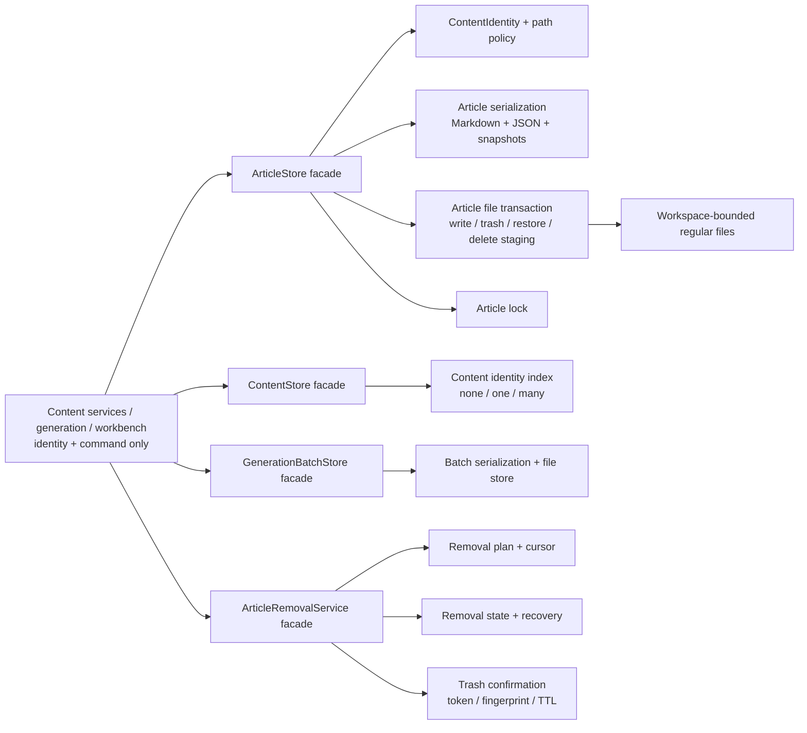
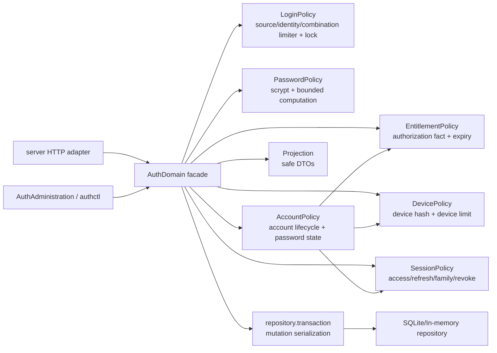

# Phase 8 交接：旧架构删除与最终验收

## Ticket 14 执行交接（2026-08-05，功能、故障与安全最终验收）

- 状态：Ticket 14 `IN_PROGRESS`；源码功能/故障/安全矩阵与 Electron boundary 自动项通过，但完整 root suite 仍有 4 个可归属的制品前置失败。Phase 8 保持 `IN_PROGRESS`，正式 release 保持 `BLOCKED_RELEASE`。
- 证据：完整 ledger、逐 case traceability 与安全摘要见 [`phase-08-ticket-14-functional-fault-security.md`](phase-08-ticket-14-functional-fault-security.md)，机器可读的自包含 canonical manifest 见 [`phase-08-ticket-14.json`](../phase-08-ticket-14.json)。
- 自动结果：root `1605/1609` pass、`4` artifact failures、`0` skip；Auth `49/49`；links `184/184`；media transport `9/9`；diagnostics `40/40`；architecture `74/74`；Phase 8 gates `3/3`；Electron focus `14/14`；packaging `48/48`；release evidence `6/6`。Gate capability `109/109` reachable，legacy source/archive `0/0`，archive 状态 `NOT_APPLICABLE`。
- 制品失败：3 个物理 alpha archive 断言为 `ASSERTION_FAILURE`（归一化 owner category `ARCHIVE_MISSING`），另有 1 个 `PLAYWRIGHT_NODE_UNAVAILABLE`；4 项逐条记录测试文件/名称/行号，均为自动 `PENDING_ARTIFACT`、不需要人工复核，转交 Ticket 15，不在 Ticket 14 添加 wrapper 或伪造通过。
- 工具链：lint、main/Renderer/bridge typecheck、format、Renderer build `2171` modules、preload build、`git diff --check` 全部通过；依赖只从本机 cache 离线安装，未访问真实 workspace/账号/外部平台。
- 人工门：真实账号/签名登录、媒体 TLS/DNS/redirect、proxy source、签名、installer、external E2E、Auth RPO/RTO/backup/recovery drill 继续 `PENDING_HUMAN`；不标记为通过。
- Git：Ticket 14 证据 manifest、专项交接和本节已 stage 以满足 canonical evidence 的 Git tracking 要求；未 commit、push 或创建 PR。历史 `docs/review/` 文档和 `.scratch` 计划文件未修改。

## Ticket 13 执行交接（2026-08-05，旧测试、依赖、构建残余与门禁）

- 状态：Ticket 13 `COMPLETE`；Phase 8 仍为 `IN_PROGRESS`，正式 release 仍为 `BLOCKED_RELEASE`。本轮只完成 cleanup 与自动化验收，不批准后续功能、迁移容量或人工 release gates。
- 分支：`codex/refactor-program`；工作树保持未 stage、未 commit、未 push、未创建 PR。未修改历史 review/OPT 文档，用户提供的 `.scratch/phase-08-cleanup-acceptance/issues/` 计划文件保留。
- 修改边界：删除已证明无 production caller 的旧 publisher/router、旧 publisher 穿透测试和无 owner cleanup script；收缩 Playwright/Doubao 诊断 seam；迁移 runtime manifest source；移除 renderer production Vite 重复声明；新增 Phase 8 gate、测试、CI/release evidence。未改变稳定 IPC inventory（109 capability）、业务 schema、Domain/Application public contract、Auth schema 或真实数据。

### 删除与替换记录

| 删除/收缩对象 | 证据与替换 | 结果 |
|---|---|---|
| `src/infrastructure/publishers/legacy-adapter-publisher.js`、`publisher-router.js` | source/import/archive absence 扫描为 0；由 `desktop/services/desktop-publisher-router.js` 组合 `worker-publisher` 与 `media-publisher` | 旧 compatibility publisher 不再存在，生产路由有唯一 owner |
| `tests/phase-03-publisher-adapter.test.js` | 删除旧 implementation 穿透测试；新增 `tests/desktop-publisher-router.test.js` 覆盖真实 desktop publisher owner、platform/media 委派与 evidence/outcome | replace-don't-layer |
| `scripts/cleanup-source-runtime.js` | 无 production caller、无 owner；由现有 prepare/package 流程和 package boundary gate 负责生成物隔离 | 无 wrapper 回流 |
| tracked `build/runtime-tools-manifest.json` | 新增 `config/runtime-tools-manifest.json` 作为唯一 source；`prepare-runtime-tools.js` 写入 build staging；pack config 排除 source/build manifest | generated output 不再 tracked/shipped |
| `runCode(jsCode, numericTimeout)` 兼容分支、Playwright `screenshot` export | caller 只使用 options object 与 `open/evaluate/close`；Doubao 改为结构化 JSON diagnostic | 旧签名和 screenshot seam 归零 |
| Doubao 新 PNG 诊断 | 保留 JSON summary；trim 阶段删除升级遗留 `.png`，并有 legacy PNG 回归 | 不继续产生原始截图，遗留敏感 artifact 可清理 |
| renderer production `dependencies.vite` | Vite 保留为唯一 `devDependencies` 直接声明，`media-workbench/package-lock.json` 同步 | 构建不依赖 peer 间接安装，production dependency 收缩 |

### Phase 8 gate 与模块例外

`auto—publish/scripts/verify-phase-08-gates.js` 固化以下检查：

| gate | 保护内容 |
|---|---|
| `dependencyDirection` | `src → desktop`、Domain/Application → implementation、Renderer → Node/infrastructure、worker/adapter → OperationalStore writer |
| `operationalStoreBoundary` | internal OperationalStore 只能由 facade/internal owner 导入；migration 只允许 recovery guard 的精确 importer→specifier 例外 |
| `uniqueOwnersAndWriters` | publication/remote publisher 唯一 owner、SQLite writer、worker/adapter 不写 store、退休 writer absence |
| `capabilityReachability` | 109 项 registry capability 通过真实 TypeScript symbol/call reachability evidence；不再以 fixture 非空字段计数 |
| `legacyAbsence` | source 与 production archive 的 retired path/旧 publisher/cleanup script absence |
| `moduleSize` | 400 行阈值、已审查 ceiling、缺少/超限/已降到阈值以下但未删除的 stale exception |
| `trackedGeneratedOutput` | tracked build/dist/release/coverage/map/log 等生成输出 absence |
| `packageBoundary` | ASAR、unpacked 与 resources extraResources 的私有内容、旧 source、sensitive text（含 `.js/.cjs/.mjs`）、link absence；仅允许生成 preload |

CI required check 为 `required/phase-08-gates`，release evidence contract 与 checklist 同步收录该 check。CI-only verifier、module exception 清单和 build-input runtime manifest 明确排除 production ASAR。

模块规模例外共 37 项，完整的 `file / ceiling / reason` 表以 `auto—publish/scripts/module-size-exceptions.js` 固化；代表性深模块包括 submission owner（1980）、content IPC declarations（1328）、media feature（793）、article removal（764）、OperationalStore submission aggregate（683）、preload（607）、workspace composition（601）及 vendor adapters（502/429）。例外不是 waiver：文件删除、路径不存在、缺 reason、超过 ceiling 或降至 400 行以下而未移除条目均 fail。

### 独立审计、最小修复与专项复验

首轮独立 `sol`（medium）只读审计发现 1 个 P1、3 个 P2、1 个 P3：

1. package sensitive scan 跳过生产 JavaScript；扩展文本文件集合到 `.js/.cjs/.mjs`，加入 ASAR 中 JS key 负例。
2. Doubao 仅筛选 JSON 会遗留升级前 PNG；停止生成 PNG 但在 trim 时清除遗留 PNG，并加入 fixture 回归。
3. renderer build 依赖 peer 间接提供 Vite；恢复为唯一直接 `devDependencies.vite` 并同步 lockfile。
4. capability reachability 只校验 fixture metadata；改为消费真实 TypeScript symbol evidence，并以 109 项可达性计数。
5. module exception 在降到 400 行以下后不会失效；stale exception 现在直接违规，要求删除条目。

主线程未采用扩大接口或 wrapper 的方式修复。第二轮独立 `sol`（medium）复审未发现 P0/P1，但发现 3 个 P2 门禁覆盖缺口：package boundary 漏扫 resources 下 extraResources、Renderer 规则漏掉 bare Node builtins、owner/writer 规则漏掉 qualified SQLite writer 且只确认 publisher owner 文件存在。最小修复为递归纳入 extraResources、使用 `node:module` builtin 集合、识别 qualified `DatabaseSync`/SQLite open 并以受控 publisher owner inventory 检查唯一性；新增三类反例回归。

第三轮也是约定的最后一轮独立只读 `sol`（medium）复审结果为 `P0=0、P1=0、P2=0、P3=2`：extraResources 敏感负例断言不独立、publisher inventory 原依赖文件名。主线程随后将两处敏感命中拆成独立断言，并让 owner 候选按 publisher surface 定义识别而不依赖文件名；未再启动第四轮。最终专项复验为 gate 测试 `3/3`、fresh package resources gate `PASSED`，三套 typecheck、lint、format、`git diff --check` 均通过；三轮 subagent 均只读，未修改、stage、commit 或 push。

### 最终自动化证据

| 命令 / 证据 | 结果 |
|---|---:|
| root suite | 238 个测试文件，1608/1608 pass，0 fail；最新 gate 专项 3/3 |
| Auth suite | 49/49 pass |
| `npm run pack:production:smoke:dirty` | 首次下载 Electron 时网络 `ETIMEDOUT`；重试成功，renderer 2171 modules、preload sandbox 3/3、production package verifier 通过 |
| fresh Phase 8 package gate | `PASSED`；ASAR 1798 entries、unpacked 385、extraResources 5；private/legacy/sensitive/link violations 0；capability `109/109`，source/archive legacy absence `0/0`，module-size/stale `0/0` |
| `npm run lint` | 通过 |
| main/renderer/bridge typecheck | 全部通过 |
| `npm run format:check` | 通过 |
| renderer `npm ci --dry-run` | 通过 |
| `git diff --check` | 通过 |

所有测试和 package fixture 均为临时/合成/离线输入；未访问真实 workspace、Auth 数据、账号、Cookie、供应商、投稿、同步、扣费或外部平台。正式 release 的人工签名、installer、TLS/DNS、external E2E、RPO/RTO 与 rollback gates 继续保持 `PENDING_HUMAN`/`BLOCKED_RELEASE`。

## Ticket 04 执行交接（2026-08-02，Content storage and lifecycle internals）

- 状态：Ticket 04 `COMPLETE`；代码与 Content 专项自动化 `GREEN`；Phase 8 仍为 `IN_PROGRESS`，正式 release 仍为 `BLOCKED_RELEASE`。
- 分支：`codex/phase-08-ticket-04` 已提交 `d4510bf`，并已由 merge commit `d60424a` 合并回 `codex/refactor-program`；未 push 或创建 PR。
- 修改边界：保留既有 Content application facade、Content IDs、article DTO、Markdown/sidecar 格式、generation batch schema、removal token/fingerprint/TTL 与 error codes；仅把内部身份、序列化、路径、文件事务和生命周期恢复职责移入协作者。未修改 Domain/Application interface、Publication/OperationalStore schema 或真实数据。
- 追加最小修复：trash listing/recovery 现在与 restore 共用 per-article lock；shared `content-path-policy` 的 workspace-root boundary 已接入 research、question 与 legacy migration；generation batch 列表会从合法 `.journal/.bak/.tmp` artifact 推导 canonical 文件并先 recovery。接口、DTO、schema、token/fingerprint/TTL 与 error codes 均未改变。

### Content 模块图与责任



- `ContentIdentity` 只校验逻辑 identity 和安全 segment；`content-path-policy` 统一 workspace、client、generated article、template、batch、trash、cache 的 lexical/canonical/link boundary 检查，不读取业务正文。
- `ArticleStore` 仍是文章文件的唯一 facade；`article-serialization` 负责 normalization、JSON/Markdown 和 snapshot 契约，`article-file-transaction` 负责临时文件、rename、pair rollback/recovery，`article-lock` 负责 `.article-lock` ownership 与 stale/unknown fail-closed。
- `ContentStore` 仍提供稳定列表、snapshot、fingerprint 和 0/1/many identity 结果；`content-identity-index` 只负责索引，不成为第二 writer。Material/template/catalog facades 复用同一 path policy；generation batch 由 serialization/file-store 隐藏文件名、revision 和写入顺序。
- `ArticleRemovalService` 仍是唯一 lifecycle owner；plan、cursor、state、confirmation 只拆内部职责。Trash move/restore/permanent-delete 继续由同一 transaction/recovery 状态收敛，queue residue 仍通过既有 application service action 处理。

### 路径与兼容边界复核

- 生产 Content/generation/trash caller 只传 client/article/batch identity 和 command；没有 caller 侧客户目录拼接、optional unique finder 或临时文件顺序。Article `findByGenerationTaskId` 仍保留 `none/one/many` 语义，因为它是既有稳定 application surface。
- `client-knowledge.js` 的 metadata identity reader、`question-store.js`/`research-store.js` 的 legacy 内容 reader，以及 `legacy-migration.js` 的受支持旧格式解释器仍包含各自 module-internal `path.join`。这些不是 caller 侧 path API，也没有把物理布局暴露给 IPC/View；迁移 adapter 仍是一次性、受控输入的 reader/writer 边界，unknown/corrupt 输入保持 fail-closed。它们没有被伪装为新的通用 path seam，也没有访问真实内容库。
- symlink/junction、普通文件、path traversal、canonical workspace escape 和缺失/损坏状态均在 shared policy 或既有 reader boundary 拒绝；测试使用临时合成 workspace。没有执行真实 trash、restore 或不可恢复删除。

### 事务与恢复不变量

- 普通文章/Batch/Material 写入先写唯一临时文件，必要时 fsync，再 rename 到目标；失败时清理临时文件并保留原目标。article pair、trash pair 和 sidecar/tombstone journal 的拓扑或 fingerprint 不可证明时停止并保留可恢复状态。
- Article lock 的 owner、路径和 operation identity 必须匹配当前 runner；live、dead、unknown、corrupt 或 ABA lock 不会被盲目回收。重复 runner 通过 transaction cursor/fence fail-closed，重启后由原 operation 恢复。
- Trash move/restore 采用 journal/tombstone 与 pair checkpoint；permanent-delete 先校验 version、token、fingerprint、TTL 和确认上下文，再进入 staging；staging 中断可从 cursor 恢复，冲突或外部篡改转入 repair，不直接扩大删除范围。
- Trash 的公开 tombstone/read/list 路径在 recovery 前获取与 restore 相同的 article lock；restore 持锁期间的 list 不会进入 unlocked recovery。新增真实子进程暂停测试证明竞态返回 `ARTICLE_STORE_BUSY`，不会拆散 JSON/Markdown pair。
- workspace root 本身为 junction/symlink 时，research、question 和 migration 在写入前以既有安全 error code fail-closed；batch 启动列表只接受合法事务后缀，不猜测非法 artifact 的身份。
- Generation/removal junction、rename、临时文件和 recovery cursor fault 不会绕过 workspace boundary；恢复动作只使用原 operation identity，不重新猜测目录布局。

### 自动化证据

| 命令 / 证据 | 结果 |
|---|---:|
| `tests/phase-08-content-lifecycle.test.js` | 5/5；另覆盖 restore 持锁期间 trash listing 的并发保护 |
| Article/batch/path/migration 回归定向组合 | 28/28 article、6/6 batch、96/96 content/link/migration、33/33 lifecycle/removal |
| Content/lifecycle 定向与拆分组合 | 147/147、69/69 |
| `npm run test:links` / `npm run test:migration` | 184/184、57/57；file-symlink=yes、directory-junction=yes |
| Phase 02/05/06/08 architecture/caller 组合 | 168/168 |
| `npm run lint`、main/renderer/bridge typecheck、定向 Prettier、`git diff --check` | 全部通过 |
| alpha packaging、`verify-alpha-package`、alpha smoke/ASAR/retired-path 组合 | 46/46、通过、8/8 |
| 完整 `npm test` / `node scripts/run-tests.js` | 230 个测试文件、133 suites、1500/1500 pass、0 fail、0 skip；约 317 秒 |

完整 root suite 通过前使用了 dirty alpha package 作为本地验证制品；构建输出、release 目录和临时日志均未进入 source diff。所有 fault/migration/link/security fixture 都是临时合成目录；未访问真实内容库、未执行真实永久删除、未连接外部投稿或付费系统。

### 删除记录与停止条件

- ArticleStore、ContentStore、GenerationBatchStore、Template/Material facade 和 Removal/Trash facade 中的长职责已拆为上述内部模块；旧 helper 的实现穿透不再是生产 caller 的依赖。当前保留的 client/research/question/migration path 代码属于 reader/compatibility owner，后续只能在有 production/migration caller=0 的证据后由专门 ticket 删除。
- 未改变 Content application interface、业务 identity、schema、DTO、token/fingerprint/TTL 或 error code，因此没有触发重开 Phase 1/5。正式 release 的人工账号、远端、签名、安装器、真实恢复等 gates 仍为 `PENDING_HUMAN`/`BLOCKED_RELEASE`，本 Ticket 不将其标为通过。
- 本交接记录的验证结果已固化于 Ticket 04 commit `d4510bf` 与主分支 merge commit `d60424a`；未 push 或创建 PR。

## Ticket 11 执行交接（2026-08-02，Auth policy internals）

- 状态：代码与 Auth 专项自动化 `GREEN`；Phase 8 仍为 `IN_PROGRESS`，正式 release 仍为 `BLOCKED_RELEASE`。
- 分支：`codex/phase-08-ticket-11`；未 stage、commit、push 或创建 PR。
- 修改边界：仅拆分 AuthDomain 内部策略、移除无 production caller 的 `auth-store` 兼容测试入口、补充 facade/projection contract test；未修改 Auth schema v2、HTTP routes/status、稳定错误码、token/hash/device contract、desktop Auth IPC 或真实数据。

### Auth 模块图与责任



- `AuthDomain` 是唯一组合 facade：负责 mutation serialization、登录成功/失败顺序、锁定与授权不变量、refresh reuse 的安全响应以及稳定结果投影；不解析 proxy header、不写 HTTP response、不持有 SQL handle。
- `PasswordPolicy`、`AccountPolicy`、`DevicePolicy`、`SessionPolicy`、`EntitlementPolicy` 和 `auth-projection` 隐藏各自算法与 raw row/token 边界；`SourceResolver`、`LoginPolicy`、`BoundedWindowLimiter` 仍是独立来源解析/限速职责，不向 HTTP caller 泄漏组合顺序。
- Repository 继续拥有 SQLite 事务、WAL、migration 和持久化；HTTP 只负责 body/field validation、source resolution、route dispatch 和安全错误映射。

### Public facade 与 schema 证据

- Facade 保留 login、refresh、inspect、logout、changePassword，以及既有 administration/query 方法；`/v1/auth/login`、`refresh`、`logout`、`change-password`、`session`、`entitlements` 路由和 `SAFE_ERRORS` 未改变。
- 运行时 session 仍使用 `token-service.hashToken` 与 repository 的 `access_token_hash`/`refresh_token_hash`；device 仍使用同一 `deviceKeyHash`；schema marker 仍为 `2`。
- DTO 只通过 projection 输出，contract test 覆盖 password hash、device hash、access/refresh hash 和 entitlement token 不出现在安全 DTO；没有新增测试专用 public setter 或 raw Map/SQL seam。
- `auth-server/src/auth-store.js` 已删除；HTTP test 改用 `InMemoryAuthRepository + AuthDomain`，不再通过旧 compatibility helper 或 `opts.store` 进入 production composition。

### Ticket 11 自动证据

| 命令 | 结果 |
|---|---:|
| `npm run test:auth` | Auth `49/49`，14 suites；包含 facade/projection contract、migration/session、device、entitlement、health 和 concurrent login |
| `npm run test:health-rate-limit` | health `9/9`；source resolver/limiter `9/9`，覆盖 100k identity、TTL/LRU、trusted proxy 和 restart |
| `node --test auth-server/tests/backup-restore-migration.test.js` | `13/13`，覆盖 backup destination、restore zero-side-effect、v1/v2 migration、WAL、跨进程 snapshot |
| `npm run test:migration` | `56/56` |
| `npm run test:packaging` / `test:diagnostics` / `test:links` | `46/46` / `32/32` / `181/181` |
| `npm run test:legacy-absence` | source named matches `0`、archive named matches `0`（archive `NOT_APPLICABLE`） |
| `npm run lint`、`typecheck:main`、`typecheck:renderer`、`typecheck:bridge`、`format:check` | 全部通过；renderer 在补齐其独立 lockfile 依赖后通过 |
| `node --test tests/j4125-auth-contract.test.js tests/phase-08-reverse-dependencies.test.js` | `4/4` |
| `git diff --check` | 通过 |

Root `npm test` / `npm run test:desktop-core` 已在本机安装两套 lockfile 依赖后尝试；Windows Node test runner 在 400 秒以上仍未返回最终 summary，工具以 `-1` 结束，现场只看到持续通过的 Phase 06 测试输出，未形成可归因于本 Ticket 的失败断言。该全量 runner 证据保持 `PENDING_ENVIRONMENT`，不能标为通过，也不改变上表 Auth/相关定向证据。

### 安全、恢复与人工门

- 所有自动化继续只使用 in-memory/临时 SQLite、合成身份和临时目录；未访问真实 Auth DB、账号、Cookie、token、生产服务或外部投稿/付费系统。
- Phase 7 的 Auth RPO/RTO numeric target、trusted proxy source chain、Docker container、TLS/DNS、签名、installer/rollback 和 external E2E 人工门继续为 `PENDING_HUMAN`，正式 release 继续 `BLOCKED_RELEASE`。

## Ticket 02 执行交接（2026-08-02，当前记录）
## Ticket 03 最小修复与专项复验收口（2026-08-03，最新记录）

- 状态：Ticket 03=`COMPLETE`；Phase 8 仍为 `IN_PROGRESS`，正式 release 仍为 `BLOCKED_RELEASE`。本轮没有自动提交。
- 修复范围：针对独立 `sol` subagent（中等推理强度）确认的 migration payload 失败清理误删 live-B 与 importer allow-list 过宽，migration 仅在当前路径仍对应原 fd 文件身份且 token 未变时清理不完整 lease；结构门禁对 migration importer 使用精确 importer→specifier allow-list，仅允许 recovery guard。前一轮的 `operational-store-recovery-guard.js` 继续以 SQLite `BEGIN IMMEDIATE` 串行化 runtime/migration 的 acquisition、失活回收与 release。未改变 OperationalStore facade、public surface、schema、caller 或业务语义。
- 回归：live-B replacement、ENOSPC 空锁清理、精确 allow-list 和静态副作用 import 回归均通过；本地定向 lease/migration/facade/结构组合20/20，独立 subagent 专项相关回归45/45，P0/P1/P2/P3均为0。最终完整 root suite 本轮为230个测试文件、132 suites、1501/1502 pass，唯一失败仍为既有 offline Electron storage-boundary 波动；隔离 `tests/packaging-runtime.test.js` 为7/7通过。
- 质量门禁：`npm run format:check`、`npm run lint`、`npm run typecheck:main`、`npm run typecheck:renderer`、`npm run typecheck:bridge` 与 `git diff --check` 全部通过。subagent 只读、未修改、未 stage、未 commit、未 push、未 PR；本轮仍只使用临时/合成 fixture，未访问真实 workspace、Auth 数据、账号、Cookie、供应商或外部平台。

## Ticket 03 专项复验整改交接（2026-08-02，最新记录）

- 状态：Ticket 03 `COMPLETE`；Phase 8 仍为 `IN_PROGRESS`，正式 release 仍为 `BLOCKED_RELEASE`。本轮没有自动提交。
- 专项复验：独立 `sol` subagent（中等推理强度）发现 2 个 P1 与 1 个 P2：未取得 migration lease 的 contender 会在 `finally` 删除他人锁；runtime/migration 失活锁回收存在 ABA 删除窗口；importer 门禁遗漏 `auth-server` 且漏判恰好指向 internal 目录的导入。subagent 只读复验，未修改、stage 或 commit。
- 最小修复：migration 仅在本次 token 成功取得且当前锁仍匹配时清理；失活 runtime/migration lease 删除前重新确认 token，invalid runtime lock fail-closed；结构门禁加入 `auth-server/src`、`auth-server/scripts`，并把 internal 判断收紧为目录本身或其子路径。新增“contender 不得删除他人 migration lock”回归。

### 专项复验后的证据

| 命令 / 证据 | 结果 |
|---|---:|
| lease、migration、OperationalStore、facade、结构与 reverse-dependency 定向组合 | 33/33 |
| `npm test` | 230 个测试文件、132 suites、1497/1497 pass、0 fail、0 skip（300.188 秒） |
| `npm run format:check`、`npm run lint`、`typecheck:main`、`typecheck:renderer`、`typecheck:bridge` | 全部通过 |
| `git diff --check` | 通过 |

本轮仍只使用临时/合成 fixture，未访问真实 workspace、Auth 数据、账号、Cookie、供应商或外部平台；工作树保持未 stage、未 commit、未 push、未 PR。

## Ticket 03 独立审计整改交接（2026-08-02，最新记录）

- 状态：Ticket 03 `COMPLETE`；Phase 8 仍为 `IN_PROGRESS`，正式 release 仍为 `BLOCKED_RELEASE`。本轮没有自动提交。
- 审计：按用户要求由独立 subagent（`sol`，中等推理强度）只读审计；主线程复核确认 3 项发现成立：runtime/migration lease 检查与创建存在 TOCTOU 窗口（P1）、migration 被强杀后 `migration.lock` 无失活回收（P1）、缺少 production caller 直导 internal module 的结构门禁（P2）。subagent 未修改、stage 或 commit。
- 最小修复：`operational-store-owner-lease.js` 在原子取得 `runtime.lock` 后重新检查 migration lease，失败时按 token 释放刚取得的 owner，并保留失活 runtime owner 回收；`migrate-operational-store-v1.js` 为 migration lease 写入 token、仅回收可确认已退出 PID 的失活锁，并在取得 migration lock 后、构建临时库前重新检查 runtime owner；`phase-08-operational-store-internals.test.js` 增加 production-root importer 门禁。同步补充两侧 lease 二次检查、强杀恢复回归。
- 分支/HEAD：`codex/phase-08-ticket-03` / `bcaba68b47681f3dd6b1e5c2b1141f1ce242725b`；工作树保持未 stage、未 commit、未 push、未 PR。

### 独立审计整改复验

| 命令 / 证据 | 结果 |
|---|---:|
| lease、migration、OperationalStore、facade、结构与 reverse-dependency 定向组合 | 32/32 |
| `npm test` | 230 个测试文件、132 suites、1496/1496 pass、0 fail、0 skip（395.916 秒） |
| `npm run format:check`、`npm run lint`、`typecheck:main`、`typecheck:renderer`、`typecheck:bridge` | 全部通过 |
| `git diff --check` | 通过 |

本轮验证覆盖 migration 强杀后的失活 lock 回收、runtime/migration 双侧取得锁后的二次检查和内部 importer 门禁；仍只使用临时/合成 fixture，未访问真实 workspace、Auth 数据、账号、Cookie、供应商或外部平台。

## Ticket 03 执行交接（2026-08-02，审计前基线）

- 状态：Ticket 03 `COMPLETE`；Phase 8 仍为 `IN_PROGRESS`，正式 release 仍为 `BLOCKED_RELEASE`。完整 root suite 已取得最终汇总并通过。
- 分支/HEAD：`codex/phase-08-ticket-03` / `bcaba68b47681f3dd6b1e5c2b1141f1ce242725b`；未 stage、commit、push 或 PR。
- 修改边界：仅拆分 `OperationalStore` 内部实现、增加 facade/结构门禁、扩大 format 检查 glob；没有改变 public method surface、schema version、error code、caller、PublicationWorkflow 语义或真实数据。

### Facade contract 与内部模块图

`src/infrastructure/operational-store/operational-store.js` 现为 82 行 facade，只负责组装受控 context、聚合协作者和冻结既有 35 个 public keys；caller 仍只获得业务意图方法，不获得 `db`、statement、SQL、表名或 transaction helper。`SCHEMA_VERSION` 仍为 `3`，facade 仍导出 `createOperationalStore` 与 `verifyOperationalDatabase`。

```text
createOperationalStore (facade)
  -> operational-store-runtime
       -> owner-lease + schema/migration + verifier
  -> operational-store-context
       -> transaction (BEGIN IMMEDIATE / beforeCommit / COMMIT|ROLLBACK)
       -> utils (safe serialization, evidence/display validation, stable errors)
  -> publication-aggregate   (account profile, target reservation, outcome, publication read model)
  -> submission-aggregate    (batch/item claim, revision, checkpoint, archive eligibility)
  -> recovery-aggregate      (recovery intent, post-processing, publication attention)
  -> order-aggregate         (remote order evidence, observation, bounded display projection)
  -> maintenance-aggregate  (verify, backup)
```

| 内部职责 | owner | 关键不变量 |
|---|---|---|
| runtime / owner lease | `operational-store-runtime.js` + `operational-store-owner-lease.js` | `runtime.lock` 与 migration lease 互斥；单 production write owner；失活 owner 才可回收 |
| schema / migration / verification | `operational-store-schema.js` + `operational-store-verifier.js` | v1→v2→v3 连续历史；数据 hash、列/约束/FK、WAL integrity 和 future schema fail-closed |
| transaction / context | `operational-store-context.js` + `operational-store-transaction.js` | 聚合只能共享受控 transaction context；`beforeCommit` 位于 COMMIT 前；异常统一 rollback |
| publication | `operational-store-publication-aggregate.js` | durable reservation、remote outcome、attempt/recovery 关系保持原子 |
| submission batch | `operational-store-submission-aggregate.js` | batch revision、claim/fence、operation checkpoint 与 cleanup action 原子化 |
| recovery / post-processing | `operational-store-recovery-aggregate.js` | uncertain/recovery intent、attention 和 post-processing 状态不散到 caller |
| order | `operational-store-order-aggregate.js` | remote order observation 不伪造 canonical outcome；display snapshot 使用有界 join/read model |
| maintenance / safe primitives | `operational-store-maintenance.js` + `operational-store-utils.js` | backup destination、HTTPS evidence、敏感字段和展示值 fail-closed |

### 删除项与引用证据

- 从 facade 中删除了原巨型实现的 `DatabaseSync`、schema SQL、owner map/lock 细节、transaction choreography、表级 publication/batch/order/recovery 查询和 verifier 实现；这些实现分别进入上述 internal owner。
- `operational-store-submission-aggregate.js` 仍为 585 行，是唯一超过 400 行的新增 functional internal；它完整拥有 batch/item claim、revision、checkpoint、cleanup 和 archive eligibility 的同一事务聚合。按 Ticket 01“行数是警报、不得把深模块复杂性散回 caller”的书面决定保留，不对 caller 暴露第二个 writer 或表级 seam。
- 没有删除或恢复任何旧 production writer、legacy migration reader 或 caller；旧 publication/batch/order JSON writer 继续由 source/ASAR absence gate 保护，worker/adapter 仍不持有 OperationalStore handle。
- 生产 caller 仍只引用 `createOperationalStore`；`tests/phase-08-operational-store-internals.test.js` 固化 public surface、schema v3、facade 无 SQL/表名/事务 choreography、internal module presence 和 frozen object。`phase-08-reverse-dependencies` 继续证明 production `src → desktop` 为 0。
- `package.json` 的 `format:check` 从单层 glob 扩大到 `src/infrastructure/operational-store/**/*.js`，覆盖新 internal modules；未改依赖或 lockfile。

### Ticket 03 自动证据

| 命令 / 证据 | 结果 |
|---|---:|
| Phase 2/3 OperationalStore、migration、capacity、fault、backup/restore、publication/order/batch/attention 定向组合 | 112/112 |
| facade、结构、reverse-dependency、alpha smoke 组合 | 6/6 |
| `npm run format:check`、`npm run lint`、`typecheck:main`、`typecheck:renderer`、`typecheck:bridge` | 全部通过 |
| `npm run pack:smoke` | 通过 |
| `npm run test:packaging` | 46/46 |
| `npm run test:links` | 181/181，file-symlink=yes、directory-junction=yes |
| `npm run test:diagnostics` | 32/32 |
| `npm run test:migration` | 56/56 |
| `npm run test:legacy-absence` | source 0 / archive 0 |
| `npm run test:discover` | 230 个测试文件 |
| `git diff --check` | 通过 |
| `npm test` | 230 个测试文件、132 suites、1493/1493 pass、0 fail、0 skip（386.270 秒） |

所有测试和 smoke 使用合成/临时/离线 fixture；未打开真实 workspace、Auth 数据、Cookie、账号、供应商或外部平台。强杀、WAL/concurrent writer、SQLITE_FULL 等效故障、corruption、migration rollback、backup/restore 已由定向矩阵覆盖；正式真实恢复、RPO/RTO 和 release 人工门仍保持 `PENDING_HUMAN`。

> Ticket 02 的交接记录保留如下，作为本 Ticket 的前置输入和历史证据。

## Ticket 02 执行交接（2026-08-02，历史记录）

- 状态：Ticket 02 `COMPLETE`；Phase 8 仍为 `IN_PROGRESS`，正式 release 仍为 `BLOCKED_RELEASE`。
- 分支/HEAD：`codex/refactor-program` / Ticket 01/02 固化 commit；未 push 或 PR。
- 修改边界：仅迁移 workspace/path、Playwright/runtime、Hepan packaged resource resolver 和对应架构/路径/打包测试；未改 workspace schema、ContentIdentity、PublicationWorkflow、OperationalStore schema/writer、Renderer 产品行为或真实数据。

### Ticket 02 的门禁与精确命中

开始前重新扫描得到的 5 条 production `src → desktop` import：

```text
src/content/client-material-store.js:6       ../../desktop/workspace-paths
src/content/generation-batch-store.js:5      ../../desktop/workspace-paths
src/core/files.js:7                           ../../desktop/workspace-paths
src/core/playwright.js:6                      ../../desktop/services/runtime-diagnostics-service
src/platforms/hepan/runtime-paths.js:5        ../../../desktop/packaging/packaged-runtime-resolver
```

新增 `tests/phase-08-reverse-dependencies.test.js` 后，红测现场为 5 个精确命中、1 test fail；迁移后同一真实 source-root 扫描为 2/2 pass，production `src → desktop` import 为 0。测试还从真实 `src/domain`、`src/application`、`media-workbench/src`、`desktop/worker` 和 `src/platforms` 检查禁止依赖与 OperationalStore writer 边界。

### 责任迁移与删除

| 责任 | 新 owner / seam | 真实 caller | 删除的旧入口 |
|---|---|---|---|
| storage/workspace path policy | `src/infrastructure/workspace/storage-paths.js`、`workspace-paths.js` | runtime config、workspace bootstrap、content/material/generation stores、offline/package smoke | `desktop/storage-paths.js`、`desktop/workspace-paths.js` |
| packaged resource validation | `src/infrastructure/runtime/packaged-runtime-resolver.js` | packaging scripts、artifact verifier、Hepan runtime、offline smoke | `desktop/packaging/packaged-runtime-resolver.js` |
| Playwright packaged path policy | `src/infrastructure/runtime/playwright-runtime-paths.js` | neutral Playwright runtime resolver、offline smoke | `desktop/packaging/playwright-runtime-paths.js` |
| Playwright/Node/CLI/Hepan executable resolution | `src/infrastructure/runtime/playwright-runtime-resolver.js` | `src/core/playwright.js`、desktop diagnostics、desktop task cleanup | `runtime-diagnostics-service` 中的 resolver 实现与 `resolvePlaywrightRuntime` 暴露 |

所有 packaged candidates 仍经过 regular-file/directory、ASAR、canonical root、link/junction 和 fail-closed 校验；packaged 分支没有恢复源码 fallback。Caller 只传 workspace/app/resources root、paths、环境和配置，不学习 Electron `app` 顺序或 ASAR 内部布局。

### Ticket 02 自动证据

| 命令 | 结果 |
|---|---:|
| `node --test tests/phase-08-reverse-dependencies.test.js` | 3/3 |
| workspace/path/content 定向组合 | 26/26 |
| runtime/packaging/Hepan/diagnostics 定向组合 | 26/26 |
| `npm run test:packaging` | 46/46 |
| `npm run test:links` | 181/181，file-symlink=yes、directory-junction=yes |
| `npm run test:diagnostics` | 32/32 |
| Phase 8 seam/architecture 扩展组合 | 82/82 |
| `npm run lint`、`typecheck:main`、`typecheck:renderer`、`typecheck:bridge` | 全部通过 |
| `npm test` | 229 个测试文件、132 suites、1490/1490 pass、0 fail、0 skip |

完整 root suite 与 `git diff --check` 均已通过；未将本 Ticket 提前标为 Phase 8 完成；人工 release gates 继续保持 `PENDING_HUMAN`。

> 以下编号章节保留 Ticket 01 的基线、调用图和后续 Ticket 决策，作为本 Ticket 的输入证据；本追加记录是当前 Ticket 02 的执行结果。

## 1. 状态

- 状态：`IN_PROGRESS`。
- 当前 ticket：Ticket 01，冻结 production 基线与 cleanup decision map。
- 开始分支与 commit：`codex/refactor-program` / `aff1dfd089aff2492f9054747ce55f94304cffdd`。
- 当前分支与 commit：`codex/refactor-program` / `aff1dfd089aff2492f9054747ce55f94304cffdd`。
- 启动时工作区：tracked source clean，staged=0；仅有用户提供的未跟踪 `.scratch/phase-08-cleanup-acceptance/issues/` 计划目录。
- 当前工作区：本 ticket 新增/修改的三份文档和未跟踪的用户计划目录；没有生产代码、测试、schema、package 或 build 输入修改；没有 stage/commit/push/PR。
- 日期与环境：2026-08-02 Asia/Shanghai；Windows 11；Node `v24.16.0`；npm `11.13.0`；Electron `43.1.1`。
- Phase 7：`COMPLETE`；Phase 4 人工验收：`PENDING_HUMAN`；正式 release：`BLOCKED_RELEASE`。

权威决策图：[phase-08-decision-map.md](../phase-08-decision-map.md)。它比本 handoff 包含更完整的 37 findings、29 OPT、33 个长模块和逐项 deletion-test register。

## 2. 已完成结果

- 从 `desktop/main.js`、`authenticated-runtime`、`workspace-runtime`、两类 composition、worker、IPC registry/preload 和 `media-workbench/src/main.tsx` 追踪了真实 production chain。
- 确认唯一 production composition/lifecycle root 是 `desktop/workspace-runtime.js`；Content owner 是 `desktop/composition/content-lifecycle-composition.js`；Publication/OperationalStore owner 是 `desktop/composition/publication-workflow-composition.js`；PlatformRun owner 是 `desktop/services/platform-run.js`；IPC owner 是 `desktop/ipc/register.js` + `desktop/ipc/contracts/production-registry.js`；Renderer invalidation owner 是 `workspace-coordinator`。
- 冻结 schema/contract 基线：workspace schema `1`、OperationalStore schema `v3`、Auth schema `2`、worker envelope schema `1`；non-Auth IPC inventory 为 109（43 query、61 command、5 event），lifecycle=21，event=5。
- 记录当前唯一确认的 5 条 production `src → desktop` 反向依赖，全部归 Ticket 02；目标是 0，不通过 re-export 或测试专用 setter 掩盖。
- 记录旧 publisher compatibility 层、numeric `runCode` signature、dead screenshot API、stale worker message type、legacy trash DTO、受控 migration DTO 和真实 worker snapshot 的不同处置；没有把所有 `legacy` 字样误判为可删除。
- 对第一方 production source 中所有超过 400 行的 33 个模块逐项给出行数、deletion test、职责分类、负责 ticket 和 blocker edge；未留下“以后再看”的模块。
- 将 37 条 finding、29 个 OPT、Phase 4/7 人工门映射到后续 Ticket 02–17；人工门仍是人工门，未标自动通过。
- 当前 ticket 未删除模块、未改 writer、未改 IPC、未改 Renderer、未执行真实迁移或外部动作。

## 3. 权威 interface 与 schema

| 名称 | 文件 / symbol | Caller | 不变量 / 错误模式 |
|---|---|---|---|
| Workspace lifecycle | `desktop/workspace-runtime.js` / `createWorkspaceRuntime` | `desktop/main.js`、authenticated runtime | 唯一 start/dispose；owned service/listener 只释放一次 |
| Content composition | `desktop/composition/content-lifecycle-composition.js` / `createContentLifecycleComposition` | workspace runtime | 唯一 ArticleStore/ContentStore composition；path/lock 不暴露给 IPC/View |
| Publication composition | `desktop/composition/publication-workflow-composition.js` / `createPublicationWorkflowComposition` | workspace runtime | OperationalStore facade + PublicationWorkflow；事务和 post-processing 不散到 caller |
| Operational state | `src/infrastructure/operational-store/operational-store.js` / `createOperationalStore` | publication/submission/order/attention services | schema v3；main-only writer；publication outcome、attempt、batch revision、order evidence、recovery intent 原子化 |
| Publication workflow | `src/application/publication-workflow.js` / `createPublicationWorkflow` | publication submission services | remote intent/outcome/attention/recovery；unknown 不自动 retry/publish |
| Platform run | `desktop/services/platform-run.js` / `createPlatformRun` | `desktop-task-service` | schema v1、runId 闭合；旧 child message 不能污染新 run；stop/watchdog/cleanup/terminal 单 owner |
| Typed IPC | `desktop/ipc/contracts/production-registry.js` / `productionIpcRegistry` | `desktop/ipc/register.js`、preload、domain bridges | 109 capability；输入输出 versioned/safe；raw error/path/Cookie/body 不过 Renderer |
| Invalidation | `desktop/workspace-data-invalidation.js` + `media-workbench/src/features/workspace/workspace-coordinator.js` | workspace services/features | runtimeId + revision；旧 workspace 事件丢弃；每个 feature 只注册自己的 scope |
| Auth | `desktop/services/auth-service.js`；`auth-server/src/auth-domain.js` + SQLite repository | Auth IPC/HTTP/AuthGate | Auth schema v2；Auth legacy envelope 与 non-Auth typed registry 隔离 |
| Diagnostics | `src/diagnostics/diagnostic-schema.js`、sinks；`desktop/services/runtime-diagnostics-service.js` | producers、Settings/diagnostics IPC | 只有 safe metadata/diagnosticId；有界 rotation；无 raw screenshot/stack/secret |

## 4. Production 调用图

```text
desktop/main.js
  -> authenticated-runtime
  -> workspace-runtime (唯一 workspace composition/lifecycle root)
     -> content-lifecycle-composition
        -> ContentStore / ArticleStore / ContentIdentity
     -> publication-workflow-composition
        -> PublicationWorkflow
        -> OperationalStore v3 (唯一 publication/batch/order writer)
        -> attention query/resolver/post-processor
     -> PlatformRun + desktop-task-service
        -> worker/run-task.js (schema v1, runId)
        -> publisher-executor -> Toutiao/Hepan/Lieju adapter
     -> media publisher/resource/order services
     -> content/generation/removal/settings services
     -> ipc/register.js -> production-registry -> preload
  -> media-workbench/src/main.tsx -> App.tsx
     -> workspace-coordinator -> domain feature owners -> typed domain bridges -> Views
```

Auth 旁路为 `desktop auth-service/auth-ipc -> auth-server AuthDomain -> SQLite repository`。release evidence 旁路为 diagnostic schema/sinks 与 artifact/evidence scripts；两者不成为业务第二 writer。

## 5. 本 ticket 文件

- 新增：[docs/refactor/phase-08-decision-map.md](../phase-08-decision-map.md)。
- 新增：本 handoff。
- 修改：[docs/refactor/13-progress-ledger.md](../13-progress-ledger.md)，顶部追加 Ticket 01 权威记录，Phase 8 行更新为 `IN_PROGRESS`。
- 删除：无。
- 用户已有但未触碰：`.scratch/phase-08-cleanup-acceptance/issues/` 全部计划文件；所有 production source、tests、package/build、历史 review 文档均未触碰。

## 6. 已删除旧路径

Ticket 01 没有执行删除。下表是“当前 absence 证据”和后续删除责任，不是本 ticket 的完成项。

| 旧 seam / writer | 当前证据 | 后续处置 |
|---|---|---|
| `src/core/jobs.js`、旧 submission paths、`src/platforms/media/preflight.js` | source/ASAR legacy absence 检查为 0；物理路径已不存在 | Ticket 13/15 继续保护 0 引用 |
| `publish-log` sender/consumer/path | source 与 production archive named hit 为 0 | Ticket 12/13 保持 absence，不恢复 sender |
| `src/infrastructure/publishers/legacy-adapter-publisher.js`、`publisher-router.js` | production import 为 0；旧 test 仍直接引用 | Ticket 13 删除旧模块和穿透测试，补真实 desktop publisher seam |
| 旧 publication/batch/order JSON writer | 当前 production composition 使用 OperationalStore v3；worker/adapter 不写 store | Ticket 03/05/13 完成 source/test/package 0 引用门 |

## 7. 数据与迁移

- Workspace schema：`1`；Auth schema：`2`；OperationalStore：`v3`；worker envelope：`1`。
- Ticket 01 不打开真实 workspace、Auth DB 或迁移输入，不执行 execute/rollback/restore。
- 受控旧内容、旧 metadata、legacy provider settings、legacy application config、unknown-account target 都保留为有证据的迁移/拒绝入口，不能在 Ticket 13 误删。
- Phase 7 的 migration、backup destination/restore-check、Auth recovery fixture 和 production directory/offline smoke 均只使用临时合成目录；正式真实恢复、RPO/RTO、rollback package 仍 `PENDING_HUMAN`。
- 下一次迁移/容量/制品验收由 Ticket 15 执行，必须重新记录 source state、相对路径、hash、schema 和人工 blocker。

## 8. 测试证据

| 命令 / 证据 | 结果 | 数量 | Skip | 环境 / fixture |
|---|---|---:|---:|---|
| `npm run test:discover` | pass | 228 文件 | 0 | `.test.js` 216、`.test.mjs` 12 |
| Phase 7 紧凑 architecture baseline | pass | 66/66 | 0 | 真实 production seam/owner 断言 |
| Ticket 01 扩展 architecture/owner/legacy/IPC command | pass | 81/81 | 0 | 临时/静态；包含 109 capability、21 lifecycle、5 event |
| `npm run test:legacy-absence` | pass | source 0 / archive 0 | 0 | 未提供 archive resources；archive `NOT_APPLICABLE` |
| `npm run lint` | pass | — | 0 | 本地 source |
| `npm run typecheck:main` | pass | — | 0 | Node/Electron main contract |
| `npm run typecheck:renderer` | pass | — | 0 | media-workbench |
| `npm run typecheck:bridge` | pass | — | 0 | strict bridge |
| `git diff --check` | pass | — | 0 | 当前文档 diff |

本 ticket 未运行完整 root suite 作为 cleanup 完成判断。Phase 7 handoff 的历史完整结果为 228 files、132 suites、1488/1488 pass、0 fail、1 个由自身条件控制的 Electron focus skip；删除/拆分后必须由 Ticket 13–15 重新执行。

故障/恢复证据边界：本 ticket 只冻结既有 fault owner 和测试入口；未注入强杀、磁盘满、WAL/corruption、真实 remote timeout、真实 login、真实 post、真实支付或真实 rollback。具体 fault matrix 归 Ticket 14/15。

## 9. 偏差与决定

- 相对 Phase 8 总计划的偏差：只执行 Ticket 01 的 evidence/boundary；没有提前删除 seam、拆长模块或运行最终功能/迁移/容量/准入验收，符合 ticket 允许修改范围。
- 当前 workspace 有用户提供的未跟踪 `.scratch` 计划文件；它是启动输入，不是可以用 `clean` 消除的代码 dirty。没有执行 reset/checkout/clean。
- architecture 证据同时记录紧凑 66/66 和本 Ticket 扩展 81/81：二者测试集合不同；后续应使用实际命令输出，不把一个集合的数量当成另一个集合。
- `runtime.lock`、`migration.lock`、`.article-lock`、removal transaction lock、diagnostic sink lock 都有 production caller；“删除旧 publication file lock”不等于删除这些当前保护。
- `legacy` 兼容面按“dead、migration-only、Auth-only、当前 production caller、stale worker contract”分类；没有因为命名相似而批量删除。
- 没有扩大 Domain/Application public interface；5 条 reverse dependency 留给 Ticket 02 的 neutral seam/injection。若消除依赖需要扩大接口，必须按停止条件重开前序阶段。
- 未更新 CONTEXT/ADR、原始 review、optimization 文档；最终文档一致性由 Ticket 17 处理。

## 10. 未完成与阻塞

- 代码未完成：5 条 reverse dependency 尚未消除；旧 test-only publisher compatibility 层尚未删除；长模块尚未拆分；Renderer domain barrel 尚未迁移/删除；全 Phase 8 cleanup 尚未执行。
- 自动验证未完成：Ticket 13 的完整 deletion/CI gates、Ticket 14 功能/故障/安全全链、Ticket 15 迁移/容量/制品、Ticket 16 admission simulations、Ticket 17 final traceability 尚未执行。
- `PENDING_HUMAN`：Phase 4 四项平台/媒体/签名登录门；Phase 7 endpoint/DNS/TLS、trusted proxy source chain、签名、installer/rollback、external E2E、Auth RPO/RTO/recovery owner、rollback package；本机 Docker 对 `required/auth-container` 的限制。
- 正式 release：继续 `BLOCKED_RELEASE`；Ticket 01 不批准 release。
- 触发的停止条件：无。当前发现的 reverse dependencies、dead compatibility candidates 和长模块均有明确 owner/ticket；没有发现活跃旧 writer、数据冲突或需要真实数据才能完成本 ticket 的判断。

## 11. 下一任务入口

- 必读文件：
  - [phase-08-decision-map.md](../phase-08-decision-map.md)
  - `.scratch/phase-08-cleanup-acceptance/issues/02-eliminate-reverse-dependencies.md`
  - `docs/refactor/01-target-architecture.md`、`02-codex-execution-protocol.md`
  - `auto—publish/desktop/workspace-paths.js`
  - `auto—publish/desktop/services/runtime-diagnostics-service.js`
  - `auto—publish/src/core/playwright.js`
  - `auto—publish/src/core/files.js`
  - `auto—publish/src/content/client-material-store.js`
  - `auto—publish/src/content/generation-batch-store.js`
  - `auto—publish/src/platforms/hepan/runtime-paths.js`
- 首个 production symbols：上述 5 个 import site；先写 reverse-dependency fail-closed architecture red test。
- 首个失败测试：Ticket 02 应新增“任一 production `src → desktop` import 即失败”的测试；若现有 path/runtime/link contract 先失败，记录实际 owner，不以 wrapper 绕过。
- 允许修改范围：依赖中立的 path/runtime resolver、composition injection、真实 caller、对应 architecture/path/link/package tests、Ticket 02 handoff/ledger。
- 禁止修改范围：OperationalStore schema/writer、PublicationWorkflow/Publisher 业务语义、Content identity/schema、Renderer product behavior、真实 workspace/外部服务、为测试新增 public setter。
- 下一阶段入口：Phase 8 仍 `IN_PROGRESS`；Ticket 01/02 已完成并由一个明确 commit 固化。Ticket 03、04、11、12 可从该 commit 分别创建独立分支/工作树并同时开始，但不得在同一工作树并发修改；handoff、进度账本和公共门禁冲突须顺序合并后统一刷新证据。Phase 8 不能标 `COMPLETE`，也不能开放正式 release。

## 12. 安全边界声明

本 handoff 和 decision map 不含 Cookie、API key、token、客户正文、生产路径、raw exception、DOM、截图或真实账号信息。所有自动化证据使用合成/临时/离线输入；未执行真实投稿、同步、扣费、恢复或发布。
