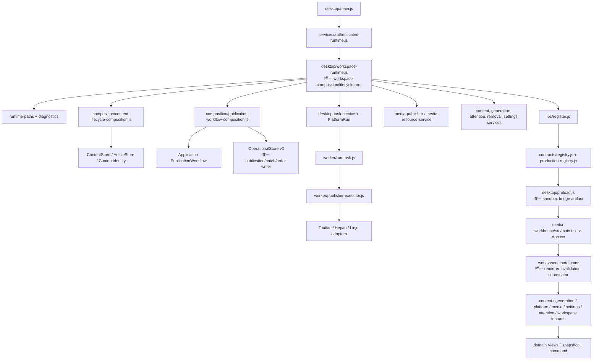

# Phase 8 Ticket 01：Production 基线与清理决策图

> 本文件是 Phase 8 Ticket 01 的只读证据与边界文件。它冻结当前 production 调用链、owner/writer、依赖违规、兼容面、长模块和后续 ticket 归属；不代表 Phase 8 已完成，也不授权删除代码或修改业务接口。

## 1. 结论与边界

- 当前 Phase 8 状态：`IN_PROGRESS`。
- 当前分支：`codex/refactor-program`。
- 当前 HEAD：`aff1dfd089aff2492f9054747ce55f94304cffdd`（Phase 7 closeout）。
- Ticket 01 只新增本证据、Phase 8 handoff 和 progress ledger 记录；没有新增产品能力、schema、公共 Domain/Application interface、IPC capability 或 Renderer 行为。
- 后续 ticket 必须以本文件的 production 可达性和阻塞边为准。测试 helper、旧审查路径和“看起来相似”的模块不能单独证明 production 引用。
- 未访问真实 workspace、内容库、Auth 数据库、账号、Cookie、供应商、Cloudflare/Tunnel、投稿、同步、扣费、生产服务或付费系统。

### 1.1 当前 Git 基线

| 项目 | 现场事实 | 处理 |
|---|---|---|
| 分支/HEAD | `codex/refactor-program` / `aff1dfd089aff2492f9054747ce55f94304cffdd` | 与 Ticket 01 期望的 Phase 7 closeout 一致 |
| tracked source diff | 0 | 未恢复、覆盖或清理 |
| staged diff | 0 | Ticket 01 不 stage |
| 工作区 dirty 原因 | 仅有用户提供的 `.scratch/phase-08-cleanup-acceptance/issues/` 计划目录未跟踪 | 作为计划输入保留，不计为 production WIP |
| Phase 7 | `COMPLETE` | 以当前 closeout commit 为输入 |
| Phase 4 人工项 | `PENDING_HUMAN` | 不伪装为自动通过 |
| 正式 release | `BLOCKED_RELEASE` | 不由 Ticket 01 解除 |

### 1.2 基线命令与结果

下表区分本 Ticket 现场复验和 Phase 7 handoff 中的紧凑基线。所有测试使用合成 fixture、临时目录、离线 fake 或静态 source/package 输入。

| 命令/证据 | 现场结果 | 说明 |
|---|---:|---|
| `npm run test:discover` | 228 个测试文件 | 216 个 `.test.js`、12 个 `.test.mjs`；`.mjs` 已进入默认收集 |
| Phase 7 紧凑 production architecture 组合 | 66/66 | 作为 Phase 7 handoff 的既有基线保留 |
| Ticket 01 扩展 production-root/owner/legacy/IPC 组合 | 81/81 | 由真实 source roots、composition、worker、legacy absence、bridge fail-closed、caller inventory、109 capability、21 lifecycle、5 event 组成；0 fail/skip |
| `npm run test:legacy-absence` | source `0`、archive `0` | 本命令未提供 archive resources，archive 状态为 `NOT_APPLICABLE`；Phase 7 production archive 另有 0 named legacy hit / 1737 entries 记录 |
| `npm run lint` | pass | ESLint |
| `npm run typecheck:main` | pass | desktop/main TypeScript contract |
| `npm run typecheck:renderer` | pass | media-workbench lint/typecheck contract |
| `npm run typecheck:bridge` | pass | strict bridge TypeScript |
| `git diff --check` | pass | 文档加入后再次复验 |

本 Ticket 没有把完整 `npm test` 的历史绿测当作 cleanup 完成证据。Phase 7 handoff 中的完整 root 结果仍为 228 文件、132 suites、1488/1488 pass、0 fail，另有一个由自身条件控制的既有 Electron focus skip；Ticket 13–15 必须在删除后重新执行完整门禁。

本 Ticket 的扩展 architecture 命令为：

```powershell
node --test tests/architecture-seams.test.js tests/phase-01-architecture.test.js tests/phase-02-architecture.test.js tests/phase-03-runtime-no-legacy-ledger.test.js tests/phase-03-worker-main-contract.test.js tests/phase-03-remote-order-legacy-path-absence.test.js tests/phase-05-production-seams.test.js tests/phase-05-production-removal.test.js tests/phase-06-legacy-path-absence.test.js tests/phase-06-production-bridge-fail-closed.test.js tests/phase-06-production-caller-inventory.test.js tests/phase-06-production-ipc-fixture-matrix.test.js
```

该命令现场为 81 tests、81 pass、0 fail、0 skip，耗时约 113 秒；它是扩展集合，不取代 Phase 7 handoff 中的紧凑 66/66 记录。

## 2. Production 调用图

### 2.1 主链



入口证据：

- `auto—publish/desktop/main.js` 调用 `createAuthenticatedRuntime` 和 `createWorkspaceRuntime`，创建 BrowserWindow、sandbox preload、renderer entry，并在退出时走 runtime dispose。
- `auto—publish/desktop/workspace-runtime.js` 是唯一 production workspace composition root；其 `start()` 创建路径、diagnostics、content composition、publication composition、PlatformRun/task、publishers、content/generation/removal/attention/settings services，再调用 `ipc/register.js`。
- `auto—publish/desktop/composition/content-lifecycle-composition.js` 是 ContentStore/ArticleStore 的唯一 desktop production composition owner。
- `auto—publish/desktop/composition/publication-workflow-composition.js` 创建 `OperationalStore`、`PublicationWorkflow`、attention ports 和 post-processing；`OperationalStore` 的 facade 是 publication、submission batch、attempt、remote order、recovery intent、post-processing 的事实写入边界。
- `auto—publish/desktop/services/desktop-task-service.js` 连接 `PlatformRun` 与 child worker；`auto—publish/desktop/worker/run-task.js` 只执行受限任务并回传 schema v1 envelope，不创建 OperationalStore。
- `auto—publish/desktop/ipc/register.js` 将业务 registrars 绑定到 `production-registry.js` 的 capability；`desktop/preload.js` 只暴露 sandbox-compatible namespace。
- `auto—publish/media-workbench/src/main.tsx` → `App.tsx` → workspace contexts/features → typed bridge。View 只消费 feature snapshot 和 command，不直接引用 `ipcRenderer`、Node 或数据库实现。

### 2.2 Auth 与 release evidence 支链

```text
desktop/main.js
  -> desktop/services/authenticated-runtime.js
  -> desktop/services/auth-service.js + desktop/ipc/auth-ipc.js
  -> auth-server HTTP route/composition
  -> auth-server/src/auth-domain.js
  -> auth-server SQLite repository
```

Auth 继续由 desktop `auth-service` 管理桌面边界，由 `auth-server/src/auth-domain.js` 管理密码、session/device、entitlement、lock 和安全错误，再由 SQLite repository 持久化。Auth 不进入 non-Auth `production-registry` 的 109 capability inventory。

```text
diagnostic-producer
  -> diagnostic-schema
  -> diagnostic-memory-sink / diagnostic-file-sink
  -> runtime-diagnostics-service
  -> structured runtime diagnostics IPC projection

scripts/create-production-artifact-manifest.js
  -> scripts/verify-production-package.js
  -> scripts/create-release-evidence-manifest.js
  -> scripts/validate-release-checklist.js
```

diagnostic 和 release evidence 只产生有界安全摘要、版本、相对 artifact 标识和 hash；validator 不批准 release。

## 3. Owner、writer、lock 与 lifecycle 决策

| 聚合/责任 | 唯一 production owner | 当前 writer/lifecycle | 读者/下游 | 锁或恢复边界 | Ticket 01 决定 |
|---|---|---|---|---|---|
| Workspace composition | `desktop/workspace-runtime.js` | 唯一 `start()`/`dispose()`；逆序释放 owned services、IPC 和 listeners | main、bootstrap、IPC | workspace runtime identity + disposal set | 保留单一深模块；Ticket 06 只拆内部阶段 |
| Content lifecycle | `desktop/composition/content-lifecycle-composition.js` | `ContentStore`、`ArticleStore`、content identity；ArticleStore 负责文章文件原子写入 | content services、generation、workbench | `.article-lock`、路径/link boundary、trash/removal transaction | lock 是当前 caller 使用的安全机制，归 Ticket 04，不删除 |
| Generation batch | `desktop/services/content-generation-batch-service.js` + `src/content/generation-batch-store.js` | 生成 batch 文件状态与 runner；不写 publication ledger | generation feature、handoff、article store | batch revision/claim 与 bounded task list | 深化到 Ticket 04；不是旧 publication batch writer |
| Publication / attempt / recovery | `src/application/publication-workflow.js` + `src/infrastructure/operational-store/operational-store.js` | main-only OperationalStore v3；事务内处理 reservation、remote outcome、recovery intent、post-processing claim | submission services、attention、orders、IPC projections | `runtime.lock` 保证 runtime writer；`migration.lock` 只保护 migration | 保留业务 facade；Ticket 03 深化内部，Ticket 05 验证 fault chain |
| Submission batch / queue actions | OperationalStore facade，由 `operational-content-submission-service.js` 调用 | 唯一 batch/item writer、claim/revision、cleanup action writer | content submission IPC、attention、trash | SQLite revision/claim；不再使用旧 JSON CAS/file writer | Ticket 03/05；旧文件路径只做 absence gate |
| Remote publisher | `desktop-publisher-router.js` → `worker-publisher.js` / `media-publisher.js` | adapter 只做外部交互和 outcome；不写 OperationalStore、不归档 | PublicationWorkflow | worker runId、account/target binding、uncertain fail-closed | Ticket 05；旧 `src/infrastructure/publishers/*` 仅测试引用，归 Ticket 13 |
| PlatformRun / child lifecycle | `desktop/services/platform-run.js`，由 `desktop-task-service.js` 使用 | 唯一 runId、child、stop/watchdog/heartbeat/terminal/cleanup owner | Platform feature、task snapshot、worker | schema v1 + runId 闭合；旧 run 消息不能修改新 run | Ticket 05/09；`progress`/`error` stale type 先证据后删 |
| Account binding | `platform-account-inspector.js` + `platform-account-binding-store.js` | publication target/profile 与实际账号检查 | platform feature、workflow | 不同账号 fail-closed，不自动迁移旧队列 | Ticket 05/09/15；Phase 4 remote account gate 仍人工 |
| Media resource/order | `media-resource-service.js`、`media-order-service.js` 读 OperationalStore | remote order observation 写入 OperationalStore；不再写旧 order JSON | media feature、Orders view | resource identity、remote order evidence、projection 幂等 | Ticket 03/05/09；Ticket 15 做容量/迁移验收 |
| Article removal/recovery | `src/content/article-removal-service.js` + scheduler | removal transaction、trash/resume/repair；workspace runtime 启动 scheduler，但服务拥有状态机 | attention、content feature、trash View | transaction lock、fingerprint/token/TTL、bounded retry | Ticket 04/08；不是可删除的“一次启动恢复器” |
| Auth | desktop auth service；server `AuthDomain` + SQLite repository | session/device/entitlement/lock 的唯一业务/DB owner | AuthGate、auth IPC、HTTP clients | Auth schema v2、backup/restore、bounded limiter | Ticket 11；不扩大 Auth public route |
| Diagnostics | `diagnostic-schema` + sinks；runtime service 负责 runtime probes | memory/file sink append/rotation/cleanup；producer 只交安全 record | diagnostics IPC、Settings | file sink lock、regular-file/path boundary、bounded metadata | Ticket 12；不删除 diagnostic lock |
| Workspace invalidation | main `workspace-data-invalidation.js` emitter + renderer `workspace-coordinator.js` consumer | main 单一 revision/scope emitter；renderer 单一 coordinator 分发 | feature owners 按 scope 注册 | runtimeId + revision，旧 workspace event 丢弃 | 保留；Ticket 08/09 只验证 feature ownership |
| Busy/command | 各 feature 的 `createCommandOwner`/command state | feature command 独占 busy/error/result；View 的局部 busy 仅限局部交互 | domain Views | `finally` 收敛、scope/request identity | 不合并为共享 busy；Ticket 08/09 检验 |
| Confirmation | `media-workbench/src/components/ConfirmationHost.tsx` | App workspace scope 下唯一 modal/confirmation host | content/platform/media/settings Views | confirm/cancel 一次、focus return、无 native confirm | 保留；Ticket 08/09 做残余检查 |
| Release evidence | scripts + build evidence manifest | evidence writer/validator；不参与业务 runtime | CI/checklist/handoff | source state、required checks、manual gates | Ticket 12/13/15；`BLOCKED_RELEASE` 不能被 validator 隐藏 |

### 3.1 当前必须保留的锁

下列锁都有 production caller，不能被“删除旧文件锁”的目标误删：

- `src/infrastructure/operational-store/operational-store.js` 的 `runtime.lock`：运行时单 writer owner 保护。
- `scripts/migrate-operational-store-v1.js` 和 OperationalStore 的 `migration.lock`：迁移 lease，与 runtime writer 互斥。
- `src/content/article-store.js` 的 `.article-lock` 与 `withArticleLock()`：文章文件事务/恢复边界。
- `src/content/article-removal-service.js` 的 removal transaction 状态/锁定语义：避免重复删除 runner 和 queue residue 分叉。
- `src/diagnostics/diagnostic-file-sink.js` 的 `withLock()`：诊断 append/rotation/cleanup 的并发保护。

这些锁的 deletion test 不是“删文件看测试是否通过”，而是证明删除后会把并发/恢复复杂性散回多个 writer；因此保留并分别交给 Ticket 03、04、12。

## 4. 依赖方向审计

### 4.1 当前 production `src → desktop` 违规（共 5 条）

| 当前 import | 当前用途 | 计划 seam | 归属 | 阻塞边 |
|---|---|---|---|---|
| `src/core/playwright.js` → `desktop/services/runtime-diagnostics-service` | `runtimeResolution()` 解析 Playwright runtime | 注入依赖中立 resolver，或把纯资源解析移到 shared/core seam；`src` 不调用 desktop service | Ticket 02 | 若需扩大 Domain/Application interface，重开 Phase 1；不得加 wrapper |
| `src/core/files.js` → `desktop/workspace-paths` | `getContentWorkspace()` 复用 workspace path factory | 将纯 path policy 下移到依赖中立模块，composition root 注入路径 | Ticket 02 | link/path 行为必须保持；若需要 caller 学习 desktop path internals，停止 |
| `src/content/client-material-store.js` → `desktop/workspace-paths` | client material 安全路径 | 同一 neutral path seam | Ticket 02/04 | Ticket 04 依赖 Ticket 02 的 0 引用 |
| `src/content/generation-batch-store.js` → `desktop/workspace-paths` | generation batch 路径 | 同一 neutral path seam | Ticket 02/04 | 不改 batch schema；path/link 回归必须先绿 |
| `src/platforms/hepan/runtime-paths.js` → `desktop/packaging/packaged-runtime-resolver` | ASAR/unpacked vendor/runtime path | shared resolver port 或 composition injection；adapter 不知道 desktop package implementation | Ticket 02/12 | packaged path 不能退回源码 fallback；若需要扩大 adapter contract，重开 Phase 4 |

Ticket 02 开始时必须重新运行精确静态查询并先写一条任一上述 import 存在即 fail 的 architecture red test。目标是 production `src → desktop = 0`，不是把引用改成不透明 re-export。

### 4.2 其他依赖方向结果

- `src/domain`、`src/application` 没有对 Electron、IPC、具体数据库或 infrastructure implementation 的 import。
- `media-workbench/src` 没有 Node、Electron、desktop 或 infrastructure import；`components/AuthGate.tsx` 对 `src/contracts/auth-contract.json` 是 contract-only JSON 输入，不是 runtime implementation 依赖。
- worker/publisher adapter 没有取得 OperationalStore writer；`desktop` composition 可以把 store facade 注入 application service，但 `desktop/worker` 只接受受限 task/adapter/outcome。
- Renderer 只经 `window.desktopConsole` typed domain bridge；没有恢复 `ipcRenderer`、Node API 或文件路径直通。
- 当前 109 个 non-Auth capabilities（43 query、61 command、5 event）由 `production-registry.js` 闭合；21 个 lifecycle query 和 5 个 event producer→consumer→disposer 均有真实 production evidence。

## 5. Phase 8 清理清单逐项处置

### 5.1 Production seam

| 清理项 | 当前证据 | 当前处置 | 负责 ticket | 阻塞边 |
|---|---|---|---|---|
| 影子 workspace runtime/controller/hooks | Phase 0/6 已切到 `desktop/workspace-runtime.js`、renderer feature/controller；legacy/architecture tests 读取真实入口 | 已无当前删除动作；保留 absence gate | Ticket 13 | 若重新出现第二 composition root，Phase 8 保持 IN_PROGRESS |
| 旧 publication ledger/batch/order JSON writer 和旧 publication file lock | production attention/content/submission tests 证明不创建旧 ledger；OperationalStore v3 是当前 writer | 继续做 source/ASAR 0 引用门；不删除 OperationalStore runtime/migration lock | Ticket 03/05/13 | 任一活跃旧 writer 立即重开 Phase 2/3 |
| 旧 jobs 远端协调、adapter 直写状态 | worker/adapter contract 证明 adapter 只回 outcome，worker 不持有 store writer；test-only legacy publisher 仍存在 | 删除 test-only compatibility publisher；保留真实 worker seam | Ticket 05/13 | 若 workflow 无法表达 outcome，重开 Phase 3/4 |
| 共享 PlatformRun 可变字段/过时 worker message | `PlatformRun` 以 runId/schema v1 校验；`progress`/`error` 没有 production sender，`heartbeat` 通过 state phase 使用 | 先在 Ticket 05 做 message producer inventory；仅 stale type 可删 | Ticket 05/13 | 任何旧消息能改新 run 即停止 |
| 页面重复 invalidation 订阅 | main 只有 `createWorkspaceDataInvalidation`；renderer 只有 `workspace-coordinator`，feature 按唯一 scope 注册 | 保留 transport；Ticket 08/09 检验每个 feature disposer | Ticket 08/09 | 发现重复 producer/consumer 时按 feature owner 修复，不造全局 bus |
| 共享 busy/native confirm | command busy 已分 feature owner；`ConfirmationHost` 是唯一 UI host；无 `window.confirm`/`globalThis.confirm` | 保留深 seam；删除局部重复后再由 Ticket 13 gate | Ticket 08/09/13 | 若新 command 无 owner，不能用共享 busy 补齐 |
| 客户路径拼接/optional finder/启动一次恢复器 | Content identity/path factory、`findByGenerationTaskId` 与 bounded removal scheduler 已为当前 seam；仍有 5 条 `src → desktop` path import | 先消除反向依赖；不删除 ArticleStore finder 或 recovery scheduler | Ticket 02/04 | path/schema/identity 语义变化重开 Phase 1/5 |
| 原始 publish-log/整页诊断截图 | `verify-legacy-absence` source/ASAR named hits 为 0；Doubao timeout 测试明确无 PNG，只写结构摘要 | 保留安全 diagnostic schema/sink；删除无 caller screenshot API候选 | Ticket 12/13 | 任何 raw screenshot/payload 重新出现，重开 Phase 4/7 |
| 公网 HTTP 隐式默认/媒体 HTTP 例外 | media endpoint 必须显式配置；HTTP 需要显式 `allowInsecure`，3xx 不跟随 | 由 feature/transport regression 和人工 gate 共同验收 | Ticket 09/14/15 | 真实 endpoint/TLS/供应商状态仍 PENDING_HUMAN |

### 5.2 测试、依赖、构建与文档

| 类别 | 当前事实 | Ticket 01 决定 |
|---|---|---|
| 测试 | `tests/phase-03-publisher-adapter.test.js` 仍直接 import 无 production caller 的旧 publisher；`runtime-diagnostics.test.js` 仍覆盖 numeric `runCode` compatibility；migration/legacy absence/worker snapshot tests 有真实或受控入口 | Ticket 13 按 replace-don't-layer 删除旧实现穿透测试；保留 migration、absence、复杂故障和真实 worker tests |
| Test double | fake publisher/HTTP/SQLite/renderer adapters 通过既有 contract，不授予 production adapter 没有的 store/write 能力 | Ticket 13 加 capability/adapter parity gate；不为旧测试恢复 wrapper |
| 依赖方向 | 5 条 `src → desktop` 是唯一已确认 production reverse dependency；其他禁止方向为 0 | Ticket 02 写 fail-closed gate；Ticket 13 固化 CI |
| 构建/包 | Phase 7 production directory/offline smoke、artifact manifest、ASAR legacy absence 已存在；本 Ticket 不重建正式 signed installer | Ticket 12/15 重跑并重新生成 evidence；生成 output 不入 Git |
| 文档 | Phase 8 handoff 尚不存在；原 review 文档只读 | Ticket 01 创建 decision map/handoff，Ticket 17 才做最终文档 closeout |

## 6. Compatibility / legacy DTO / message register

“legacy” 字样不能单独作为删除理由。下表把死路径、迁移入口、版本兼容和当前 caller 分开。

| 面 | 当前引用证据 | deletion test | 决定 / ticket | 阻塞边 |
|---|---|---|---|---|
| `src/infrastructure/publishers/legacy-adapter-publisher.js` | production `rg` 无引用；`tests/phase-03-publisher-adapter.test.js` 直接引用 | 删除后只会删除旧 adapter 测试 seam；真实 desktop publisher 不会失去 caller | 删除；先补 `desktop-publisher-router`/worker/media production seam 回归 | Ticket 13；若新 seam 需要改变 Publisher contract，重开 Phase 3/4 |
| `src/infrastructure/publishers/publisher-router.js` | 仅被上述旧 test 使用，内部再转 `legacy-adapter-publisher` | 删除不会使任何 production composition 断链 | 删除，与上一行同批 | Ticket 13 |
| adapter `legacyStatus: "pending"` | Toutiao/Lieju/Hepan adapter 返回；worker `safeOutcome()` 不传播该字段 | 删除字段后 outcome 复杂性不散回 caller；它是被丢弃的 stale DTO | 删除 stale field；保留明确 `submitted`/`uncertain` 语义 | Ticket 05/13；先确认人工 submit 与 login-required 语义 |
| `runCode(jsCode, timeout)` 数字参数 | `src/core/playwright.js` 有兼容分支；production callers 均传 options object；legacy test 直接覆盖 | 删除分支只移除一个参数转换，不要求 callers 学内部顺序 | 删除 numeric branch/test；options-only API | Ticket 02/13；先消除 `src → desktop` runtime resolver |
| `createPlaywrightRuntime().screenshot()` | export 存在；未发现 production caller；Doubao diagnostic test 验证 timeout 不写 PNG | 删除后 production 不失行为；只需移除 dead export 和 test double surface | 删除候选，不在 Ticket 01 执行 | Ticket 12/13；需先做 production caller/ASAR absence test |
| worker `progress` / `error` message types | `platform-run.js` 闭集允许；production sender 使用 `state`/`result`，heartbeat 是 `state.phase` | 删除 stale types 不会删除 runId/stop/result；若测试复杂性散回 caller 则保留为声明兼容 | Ticket 05 先生成 producer inventory，Ticket 13 再决定删除 | 任一真实 sender 出现时保留并补证据 |
| `ArticleTrashPreview/Commit.legacy` | `content-core-contracts.js`、`bridge/content.ts` 有字段；`GeneratedArticlesView` 仍按 `activePreview.legacy` 选择旧 `trashArticles` 分支 | 直接删会断当前 production caller，复杂性尚未消失 | 先迁移 View/feature 到 `applyArticleRemovalImpact`，再删旧 wire/bridge | Ticket 04/08/10/13；需保持 ArticleRemoval 语义 |
| `LegacyAuthResponse` | `media-workbench/src/bridge/auth.ts` 的 Auth-only envelope，transport 明确标记由 Phase 7 拥有 | 直接删会改变 Auth public route/bridge envelope，不是 Phase 8 局部 cleanup | 保留并隔离；只有 Auth contract migration 后删除 | Ticket 10/11；改变 route/schema 必须重开 Phase 7 |
| `LegacyProviderSettings*` / `getLegacyStatus` / `importLegacy` | runtime-config、preload、settings feature 有 explicit confirmation import | 删除会失去受控旧 provider settings 导入，不是旧 production writer | 保留为迁移入口；完成迁移/人工确认后再清理 | Ticket 09/15；不得读取 content library cookie 隐式导入 |
| `importLegacyApplicationConfig` | `desktop/application-identity.js` 有显式确认、普通文件和目标非空保护 | 删除会丢受控应用配置迁移能力 | 保留 migration-only seam | Ticket 15/17 |
| `legacy-unknown-account` target | `src/domain/publication-target.js` 显式 fail-closed，`autoExecutable=false` | 删除会让旧未知账号记录失去安全表示；复杂性不会消失 | 保留到 unknown account migration/拒绝矩阵完成 | Ticket 05/15；不能自动投稿 |
| `src/content/legacy-migration.js`、内容 metadata migration | 迁移脚本和测试覆盖旧内容、旧 research/template/article metadata | 删除会失去既有 workspace migration；不是 production writer | 保留 reader/tool；只删已无输入格式的分支 | Ticket 04/15 |
| `src/app/publish-batch.js` | `desktop/worker/run-task.js` 的 `snapshot` task 真实调用 `createQueueSnapshot`；test 覆盖 workspace input | 删除会断 worker snapshot task；复杂性属于 worker read-only snapshot，不是旧 ledger | 保留或在 Ticket 05 将 snapshot 明确归档到 worker read-only module | Ticket 05/13；不能与旧 JSON writer 混淆 |
| 已删除 named legacy paths | `src/core/jobs.js`、旧 submission paths、`src/platforms/media/preflight.js` 由 source/ASAR absence 检查为 0 | 恢复任何 wrapper 会重新引入已删复杂性 | 物理保持 absent，由 Ticket 13/15 gate 保护 | 触发即 Phase 8 stop |
| `publish-log` | source scan 和 production archive named hit 为 0；没有 preload/Renderer consumer | 恢复 sender 只会造无 consumer 状态副本 | 保持删除；结构化 diagnostic/attention/diagnosticId 是替代 | Ticket 12/13/17 |

## 7. 长模块与职责审计

统计口径：`auto—publish/desktop`、`src`、`media-workbench/src`、`auth-server/src` 的第一方 `.js/.mjs/.cjs/.ts/.tsx` production source，排除 tests、`node_modules`、`dist`、`build`、coverage；超过 400 行全部列入。行数是维护性警报，不等于“必须切碎”；纯声明表可以按领域拆分但不应被伪装成业务深度。

| 当前模块（相对 `auto—publish`） | 行数 | deletion test 结论 | 处置 | 负责 ticket | blocker |
|---|---:|---|---|---|---|
| `desktop/services/operational-content-submission-service.js` | 1976 | 删除会把预检、claim、outcome、cleanup、projection 顺序散回多个 IPC/feature caller | 内部按业务意图拆协作者，保留 application facade | 05 | 03、04 |
| `src/infrastructure/operational-store/operational-store.js` | 1891 | 删除会把 schema、事务、锁和聚合表顺序暴露给所有 caller | 内部拆 schema/migration/transaction/aggregate，保留 facade | 03 | 02 |
| `desktop/ipc/contracts/content-core-contracts.js` | 1308 | 删除会让多个 bridge/registrar 重复 wire validation/projection | 按 content lifecycle、article、removal、generation 拆纯声明/投影表 | 06/07/10 | 06 |
| `src/content/article-store.js` | 1282 | 删除会把 normalization、file transaction、article lock、migration fallback 散到 service | 按序列化、path policy、file transaction 内拆，保留 ArticleStore facade | 04 | 02 |
| `media-workbench/src/types.ts` | 1052 | 删除会让 feature/View 自己复制 DTO/type，增加跨域 drift | 按 domain types 拆；旧 barrel 只限期 re-export | 07 | 06 |
| `media-workbench/src/bridge/content.ts` | 1048 | 删除会让 View 直读 preload 或重复 request/error mapping | 按 content/generation/removal bridge 拆，保留 typed bridge seam | 07/08/10 | 06、07 |
| `media-workbench/src/components/PlatformWorkbench.tsx` | 954 | 删除并不消除平台状态复杂性，会散回多个 View；当前文件承担过多展示/交互 | 拆为 platform snapshot/task/account 子 View，状态留 feature | 09 | 07 |
| `src/content/article-removal-service.js` | 852 | 删除会把 preview/commit/recovery/token/queue residue 变成多个不一致 caller | 按 removal plan、state transition、recovery 内拆，保留 lifecycle owner | 04 | 02 |
| `desktop/services/platform-workbench-service.js` | 770 | 删除会把 adapter parsing、article source、account/target 规则散到 IPC | 按 platform read model、source normalization、target policy 内拆 | 05 | 03、04 |
| `media-workbench/src/features/media/media-feature.js` | 752 | 删除会让 media query/command/request identity/busy/invalidation 分散到 Views | 保留 feature 深模块，拆内部 resource/order/settings collaborators | 09 | 07 |
| `auth-server/src/auth-domain.js` | 453 | 删除会让 HTTP/repository 重新掌握 password/session/entitlement 顺序 | 保留 AuthDomain facade；Password/Account/Device/Session/Entitlement/Projection 已迁入 `src/domain/*` 内部策略 | 11 | 02 |
| `desktop/preload.js` | 605 | 删除会让各 IPC registrar 直接暴露 Electron transport，破坏 sandbox boundary | 按 namespace 组合生成单一 preload artifact | 06/07/10 | 05、06 |
| `desktop/ipc/media-ipc.js` | 598 | 删除会把 media preflight/order projection/request checks散回多个 caller | 拆 transport decode、projection、submission adapter；不把业务编排留在 registrar | 06/09 | 05 |
| `media-workbench/src/features/content/content-workbench-feature.js` | 592 | 删除会让 content snapshot/commands/request identity 回到组件 | 保留 content feature owner，拆 article/removal/query collaborators | 08 | 07 |
| `desktop/ipc/contracts/registry.js` | 579 | 删除会让每个 contract 复制 exact object/error/version 规则 | 纯声明/validator 内部拆分，保留唯一 registry primitive | 06/07/10 | 06 |
| `desktop/ipc/contracts/platform-contracts.js` | 576 | 删除会让 platform DTO 和 projection 漂移 | 按 task/account/run/attention 声明拆分 | 06/07/09 | 05、06 |
| `media-workbench/src/components/content/GeneratedArticlesView.tsx` | 556 | 删除会把文章管理、trash、publication history 状态散回 App | 拆纯 View 子组件；command/async 逻辑迁 feature | 08 | 07 |
| `desktop/services/content-generation-batch-service.js` | 550 | 删除会让 batch validation/runner/article handoff由 IPC 重新编排 | 按 batch plan、runner、article handoff 内拆，保留 application service | 04/08 | 02、07 |
| `desktop/workspace-bootstrap-service.js` | 522 | 删除会让 workspace selection/confirm/recovery token 散到 main/IPC | 按 bootstrap read/selection/confirmation 内拆，保留 bootstrap owner | 06 | 05 |
| `desktop/packaging/artifact-verifier.js` | 515 | 删除会让每个 package smoke caller重复 ASAR/path/hash boundary | 拆 artifact inventory、regular-file/path check、runtime assertions | 12 | 02 |
| `desktop/workspace-runtime.js` | 512 | 删除会产生第二 composition root或让 main掌握业务创建顺序 | 保留单一 lifecycle owner，只拆创建阶段和 dependency bundle | 06 | 05 |
| `media-workbench/src/features/platform/platform-feature.js` | 506 | 删除会让 run scope、queue query、account command状态散回 platform Views | 保留 feature owner，拆 task/account/query 内部模块 | 09 | 07 |
| `desktop/services/runtime-diagnostics-service.js` | 491 | 删除会让 packaging resolver、diagnostic probes、safe projection互相复制 | 拆 runtime resolver、probe、safe snapshot；保留 service facade | 12 | 02 |
| `desktop/ipc/contracts/media-contracts.js` | 477 | 删除会让 media wire bounds/order/resource target重复 | 按 resource/order/submission contract 拆纯声明/投影 | 06/07/09 | 05、06 |
| `src/platforms/toutiao/adapter.js` | 458 | 删除会把 vendor DOM/Playwright 顺序散给 worker；外部协议知识不会消失 | 保留 adapter 内聚性；仅拆 parser/evidence/browser helpers | 05 | 03、04 |
| `src/content/generation-batch-store.js` | 434 | 删除会暴露 batch file schema、atomic write和revision给 service | 拆 validation/serialization/file transaction，保留 store facade | 04 | 02 |
| `media-workbench/src/App.tsx` | 424 | 删除会让 workspace/auth/confirmation/root routing 无 owner | 拆 shell、workspace gate、navigation/feature composition；保留唯一 renderer root | 09 | 07 |
| `desktop/services/media-resource-service.js` | 423 | 删除会把 pagination/dedup/order/resource target规则散回 media IPC/View | 拆 query/pagination/order projection，保留 media application seam | 09 | 03、07 |
| `desktop/ipc/contracts/doubao-contracts.js` | 419 | 删除会让 question/collection DTO在 IPC/feature复制 | 按 question/queue/research declaration 拆分 | 06/07/09 | 05、06 |
| `media-workbench/src/components/settings/HepanProviderSettings.tsx` | 417 | 删除不会消除 settings interaction；只会把 endpoint/cookie/risk UI散回 SettingsView | 拆 settings sections，安全状态由 settings feature 提供 | 09 | 07、11 |
| `desktop/main.js` | 415 | 删除会把 Electron security/window/auth/workspace lifecycle散到不可验证入口 | 拆 window/security/bootstrap/quit helpers；保留 Electron root | 06 | 05 |
| `src/platforms/hepan/adapter.js` | 405 | 删除会把 Python payload/temp-secret/uncertain outcome顺序散回 worker | 保留 vendor adapter 内聚性；拆 payload/runtime/response helpers | 05 | 03、04、12 |
| `media-workbench/src/components/content/QuestionCollectionView.tsx` | 403 | 删除会让 collection editor/confirm/local draft状态散到 App | 拆 question list/editor/task bar；command/invalidation留 feature | 08 | 07 |

超过 600 行的 `types.ts`、contract registry/contract tables、preload namespace declaration 等允许保留的部分只因它们是 wire/type/namespace 声明；其余超过 400 行模块都有明确的内部拆分 ticket。没有“以后再看”的长模块。

## 8. Deletion-test / ticket / blocking register

执行规则：先在真实 production caller 上做删除测试。若删除后复杂性散回多个 caller，标记为深模块并内部拆分；若删除后只有无 caller export/test 消失，标记为 shallow/dead 并物理删除；若删除会改变 migration、schema、外部事实或 public interface，阻塞并重开前序阶段。

| candidate | 删除后的可观察结果 | 结论 | ticket | blocker edge |
|---|---|---|---|---|
| 5 条 `src → desktop` imports | 需要 path/runtime resolver 仍存在，但应由 neutral seam/injection 提供 | 不能删除能力，只移动责任并加 red gate | 02 | 若扩大 Domain/Application interface，重开 1/4/5 |
| OperationalStore 巨型实现 | SQL/transaction/schema 顺序会散到 submission/order/attention callers | 深 module，内部拆分 | 03 | 02 完成且 facade 不变 |
| Content/Article/Removal/Generation stores | 文件身份、锁、rollback、recovery 顺序会散回 View/IPC | 深 module，内部拆分 | 04 | 02；schema/identity 变化重开 1/5 |
| `operational-content-submission-service` | queue claim/outcome/archive/reconcile sequence 会复制到 publication/media/content callers | 深 application module，内部拆分 | 05 | 03、04；接口不足重开 3/4 |
| `workspace-runtime` / `main` / `preload` | 会产生第二 root 或 Electron transport leakage | 深 composition/bridge module，按阶段拆分 | 06 | 05；capability 变化重开 6 |
| shared Renderer `types.ts`/bridge barrel | 不删除 type knowledge，只应按 domain relocate | compatibility seam，expand–contract | 07/10 | 06；08/09 caller=0 后才能删 barrel |
| Content/Generation feature/View | request identity、busy、invalidation 会落回 component | 深 feature owner + shallow View children | 08 | 07 |
| Platform/Media/Settings/Workspace View/feature | run/account/endpoint/diagnostic state 会散回 App | 深 feature owner + View decomposition | 09 | 07 |
| old `legacy-adapter-publisher`/`publisher-router` | 只有 test-only old path 消失，真实 desktop publisher不受影响 | dead compatibility module，删除 | 13 | 05 的真实 publisher seam regression |
| `runCode` numeric branch | 只有 legacy test/argument conversion 消失 | shallow compatibility，删除 | 02/13 | 02 resolver seam |
| runtime screenshot export | 未发现 production caller；无 PNG diagnostic contract | dead API，删除候选 | 12/13 | production caller/ASAR absence |
| stale worker `progress`/`error` types | run/state/result 仍存在，若无 sender 则复杂性消失 | stale contract，证据后删除 | 05/13 | producer inventory |
| `ArticleTrash*.legacy` DTO | 当前 View 有 production branch，直接删会断链 | compatibility surface，先迁 caller | 04/08/10/13 | removal facade parity |
| legacy settings/Auth/migration DTO | 删除会破坏受控迁移或 Auth route | retain until explicit migration evidence | 09/11/15/17 | human/format/schema gate |
| old `publish-log` / named legacy paths | 已 0 引用/0 archive hit | retain absence gate, do not recreate | 13/17 | any hit is Phase 8 stop |
| current runtime/migration/article/diagnostic locks | 删除会散并发/恢复复杂性，存在真实 caller | retain and deepen internally | 03/04/12 | lock/fault tests |

## 9. Finding 到后续验收 ticket

下表覆盖 `docs/review/05-final-findings.md` 的 37 条 finding。这里的“ticket”是最终验证归属，不表示 Ticket 01 已关闭该 finding；Phase 8 cleanup 与验收需按表逐项重跑或明确重开前序阶段。

| Finding | 风险摘要 | OPT | 后续 ticket |
|---|---|---|---|
| F-H01 | 生成响应跨客户注入 | OPT-015 | 08、14 |
| F-H02 | 打开媒体稿件重置保存字段 | OPT-016 | 04、08、14 |
| F-H03 | 脱敏截图仍落盘敏感页面 | OPT-011 | 12、14 |
| F-H04 | publication crash lock 无租约回收 | OPT-002 | 03、05、14 |
| F-H05 | worker 中断留下 submitting/不可见 attention | OPT-003/004 | 05、14 |
| F-H06 | stop 提前清 busy/旧消息污染新 run | OPT-004 | 05、06、09、14 |
| F-H07 | outcome 落账失败仍归档 | OPT-003 | 03、05、14 |
| F-H08 | 头条跨行拼成功证据 | OPT-006 | 05、14；人工平台门 |
| F-H09 | 河畔 POST 后断连误判 failed | OPT-005 | 05、14；人工平台门 |
| F-H10 | ASAR 使用 Python 伪路径 | OPT-007 | 12、15 |
| F-H11 | 默认公网 HTTP 发送 key/正文 | OPT-008 | 09、14、15；人工 TLS 门 |
| F-H12 | 远端接单后 order ID 关联丢失 | OPT-009 | 03、05、14 |
| F-H13 | backup 校验错误对象 | OPT-010 | 11、15 |
| F-H14 | restore-check 创建空库并通过 | OPT-010 | 11、15 |
| F-H15 | workflow 不在 Git 根不触发 | OPT-001 | 13、17 |
| F-M01 | 非 production workspace seam 被测试维护 | OPT-001 | 13、17 |
| F-M02 | publish-log 无 consumer | OPT-028 | 12、13、17 |
| F-M03 | 初始媒体加载覆盖 invalidation 快照 | OPT-015 | 08、09、14 |
| F-M04 | 入口绕过统一 confirm/native confirm | OPT-021/024 | 06、08、09、14 |
| F-M05 | 永久删除预检异常越过 UI catch | OPT-021 | 06、08、14 |
| F-M06 | 暂停命令永久 busy | OPT-022 | 06、09、14 |
| F-M07 | 媒体分页不去重且 renderer 无界加载 | OPT-020 | 09、14、15 |
| F-M08 | 浏览器自检 checking 不收敛 | OPT-023 | 09、14 |
| F-M09 | 逻辑客户 ID 当物理目录名 | OPT-017 | 02、04、15 |
| F-M10 | 历史按 updatedAt 排序 | OPT-025 | 04、08、14 |
| F-M11 | pending_auto_recovery 只启动一次 | OPT-018 | 04、14 |
| F-M12 | permanent-delete token 未绑定版本/TTL | OPT-012 | 04、08、14 |
| F-M13 | submission batch read-modify-write 丢更新 | OPT-013 | 03、05、14 |
| F-M14 | media retry DTO 丢 resource identity | OPT-014 | 05、09、14 |
| F-M15 | ArticleStore 不支持 generationTask 唯一查询 | OPT-019 | 04、08、14 |
| F-M16 | 通用 success 文案误标 published | OPT-006 | 05、14 |
| F-M17 | profile/publication target 未绑定账号 | OPT-029 | 05、09、15；人工账号门 |
| F-M18 | 强杀/cleanup 后 Cookie/payload 残留 | OPT-011 | 12、14 |
| F-M19 | Auth limiter Map 无界 | OPT-026 | 11、15 |
| F-M20 | 默认 npm test 漏跑 `.mjs` | OPT-001 | 13、17 |
| F-M21 | 旧 seam 测试与 controller 漂移 | OPT-001 | 13、17 |
| F-L01 | 订单清空只清 React 状态 | OPT-027 | 06、09、14 |

## 10. OPT 到后续验收 ticket

下表覆盖 `docs/optimization/03-verification-matrix.md` 的 29 个 OPT；最终关闭证据仍由后续 ticket 产生。

| OPT | 主风险/验证面 | 主 ticket | 协同 ticket |
|---|---|---:|---:|
| OPT-001 | 根 CI、production seam、完整 discovery、旧测试/路径 absence | 13 | 17 |
| OPT-002 | publication lock/recovery → SQLite single writer | 03 | 05、14 |
| OPT-003 | durable recovery intent/outcome/attention | 05 | 03、14 |
| OPT-004 | immutable PlatformRun、watchdog、stop、message runId | 05 | 06、09、14 |
| OPT-005 | Hepan POST 模糊异常/uncertain | 05 | 14、15；人工平台门 |
| OPT-006 | 头条/列举文章级证据 | 05 | 14；人工平台门 |
| OPT-007 | ASAR Hepan script resolver/self-test | 12 | 15；人工制品门 |
| OPT-008 | media endpoint/HTTP confirmation/redirect/TLS | 09 | 14、15；人工 TLS 门 |
| OPT-009 | remote order observation/recovery | 03 | 05、14 |
| OPT-010 | Auth backup/restore destination verification | 11 | 15；人工 recovery 门 |
| OPT-011 | diagnostics/temporary secret/screenshot absence | 12 | 14、15 |
| OPT-012 | trash token fingerprint/version/TTL | 04 | 08、14 |
| OPT-013 | batch lost update/revision claim | 03 | 05、14 |
| OPT-014 | media resource target retry | 05 | 09、14 |
| OPT-015 | Renderer request identity/invalidation | 08 | 09、14 |
| OPT-016 | draft initialization/dirty diff | 04 | 08、14 |
| OPT-017 | logical ID/path resolver | 02 | 04、15 |
| OPT-018 | bounded removal recovery | 04 | 14 |
| OPT-019 | generationTaskId unique finder 0/1/many | 04 | 08、14 |
| OPT-020 | media pagination/dedup/capacity | 09 | 14、15 |
| OPT-021 | destructive prepare/execute UI error mapping | 06 | 08、14 |
| OPT-022 | submit/pause operation owner/busy | 06 | 05、09、14 |
| OPT-023 | settings self-check finally/busy | 09 | 06、14 |
| OPT-024 | confirmation queue/context/native confirm absence | 06 | 08、09、14 |
| OPT-025 | createdAt stable article ordering | 04 | 08、14 |
| OPT-026 | Auth TTL/LRU/source/identity capacity | 11 | 15 |
| OPT-027 | order clear projection/document semantics | 06 | 09、14 |
| OPT-028 | publish-log dead sender/typed event decision | 12 | 13、17 |
| OPT-029 | account fingerprint/target mapping/switch blocking | 05 | 09、15；人工账号门 |

## 11. Phase 4 / Phase 7 人工门映射

自动证据只能证明本地 contract、合成 fixture 和离线 package 行为；以下门仍然是人工或外部环境事实，继续阻塞正式 release。

| 人工门 | 当前状态 | 验收 ticket / owner | 不得做的替代 |
|---|---|---|---|
| Phase 4：真实平台 remote ID/profile binding | `PENDING_HUMAN` | Ticket 14/15；平台 owner | 不用 fake publisher 结果冒充真实账号绑定 |
| Phase 4：Hepan 接收后断连的远端核对 | `PENDING_HUMAN` | Ticket 14；平台 owner | 不把 uncertain 自动改为 failed/published |
| Phase 4：media HTTP 风险与测试资源/endpoint | `PENDING_HUMAN` | Ticket 14/15；media owner | 不恢复隐式 HTTP、不用固定地址豁免 |
| Phase 4：signed artifact 中真实浏览器登录 | `PENDING_HUMAN` | Ticket 15/17；release owner | 不把 unsigned/offline smoke 当真实登录 |
| Phase 7：production endpoint/DNS/TLS/hostname | `PENDING_HUMAN` | Ticket 14/15；ops owner | 不以本地 HTTPS fake 替代证书/供应商事实 |
| Phase 7：Cloudflare/Tunnel trusted source chain | `PENDING_HUMAN` | Ticket 14/15；Auth/ops owner | 不放宽 proxy header 或裸 boolean trust |
| Phase 7：signing certificate/timestamp | `PENDING_HUMAN` | Ticket 15/17；release owner | 不伪造 signed manifest |
| Phase 7：installer ACL/upgrade/rollback/SmartScreen/clean machine | `PENDING_HUMAN` | Ticket 15/17；release owner | 不把 `--dir` smoke 当 installer 验收 |
| Phase 7：external E2E | `PENDING_HUMAN` | Ticket 14/17；product/platform owner | 不连接真实投稿/付费服务完成自动门禁 |
| Phase 7：Auth RPO/RTO 数值、destination cadence、recovery drill owner | `PENDING_HUMAN` | Ticket 11/15/17；Auth/ops owner | 不把临时 SQLite recovery fixture 当生产灾备 |
| Phase 7：rollback package/procedure | `PENDING_HUMAN` | Ticket 15/17；release owner | 不把 rollback manifest 当已有可执行回滚包 |
| Auth Linux container smoke | 本机 Docker 不可用，`required/auth-container`=`PENDING_HUMAN` | Ticket 11/15；CI/ops owner | 不把静态 workflow contract 当 container runtime 通过 |

## 12. 前序阶段重开规则

Phase 8 不得用局部 wrapper 掩盖以下发现：

- 需要新增或扩大 Domain/Application public interface、改变业务 identity/target 语义：重开 Phase 1 或 Phase 5。
- 需要改变 OperationalStore schema、事务不变量、单 writer 或 migration semantics：重开 Phase 2/3。
- PublicationWorkflow/Publisher 无法表达 remote intent、uncertain、account binding 或 outcome evidence：重开 Phase 3/4，Ticket 05 停止。
- Content interface 不能表达 identity、article/removal/recovery 不变量：重开 Phase 1/5，Ticket 04 停止。
- typed IPC capability、wire DTO、preload namespace 或 Renderer public feature surface 必须新增语义：重开 Phase 6，Ticket 06/07 停止。
- Auth route、schema、token/hash/device contract 必须改变：重开 Phase 7，Ticket 11 停止。
- 真实迁移冲突、备份/恢复不一致、生产旧 writer、无法归属的状态或错误：Phase 8 保持 `IN_PROGRESS`，按 owner 重开前序阶段。
- 外部账号、TLS、签名、installer、RPO/RTO 等未知事实：标为 `PENDING_HUMAN`，不得以合成测试或文档结论改写。

## 13. Ticket 02 的最小可执行 frontier

Ticket 02 可以在本 decision map 后立即开始，且只能执行以下边界内动作：

1. 重新运行 §4.1 的 5 条 reverse import 查询，并将查询放入 fail-closed architecture test；目标为 production `src → desktop = 0`。
2. 先建立依赖中立的 path/runtime resolver seam 或 composition injection，保持 `workspace-paths`、普通文件、symlink/junction、development/packaged 行为不变。
3. 按 workspace/content、Playwright、Hepan/runtime 三批迁移真实 caller；每批立即跑对应 caller/path/package regression。
4. 所有 caller 迁移后删除旧 re-export/fallback，不留下长期 compatibility wrapper。
5. 若发现必须扩展 Domain/Application interface 或改变 schema/identity，停止 Ticket 02 并按 §12 重开前序阶段。

Ticket 02 不得开始 OperationalStore、ContentStore、Renderer feature 或 cleanup deletion；这些分别由 Tickets 03–13 的 blocker graph 管理。
